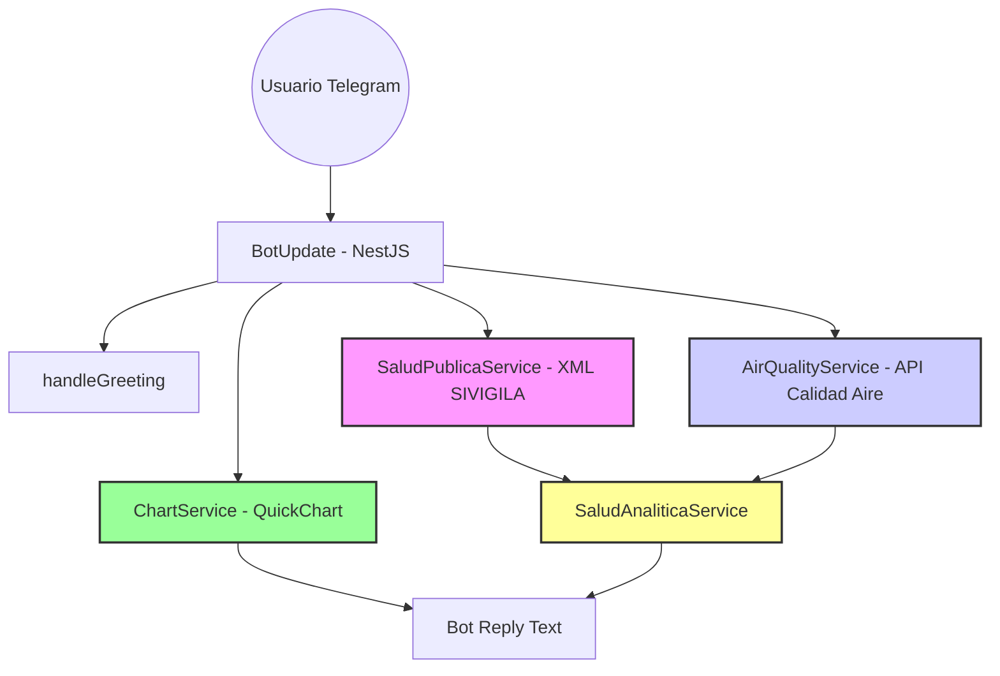
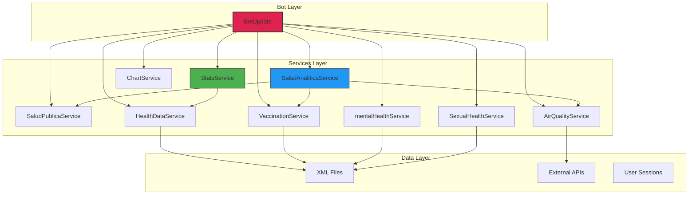

# 📄 Memoria Técnica: Salud IA Bot - Colombia

**Proyecto desarrollado para el Concurso IA Colombia**

<p align="center">
  
</p>

## 1. Introducción y Alcance

El proyecto **Salud IA Bot** es una solución tecnológica diseñada para actuar como un puente de información entre los sistemas de salud pública de Colombia y la ciudadanía. Su objetivo primordial es la **prevención de enfermedades** mediante el suministro de información experta, oportuna y accesible a través de la mensajería instantánea (Telegram).

---

## 2. Metodología de Desarrollo: Enfoque CRISP-ML

Para asegurar la calidad y el rigor técnico, el desarrollo de esta solución sigue el marco de trabajo **CRISP-ML (Cross-Industry Standard Process for Machine Learning)**.

### 2.1 Business Understanding (Entendimiento del Problema)

- **Problema:** La saturación de los servicios de salud y la falta de acceso rápido a información preventiva fiable sobre enfermedades transmisibles en Colombia.
- **Objetivo:** Crear un agente de IA que democratice la información de salud pública, reduciendo la incertidumbre del ciudadano y promoviendo hábitos preventivos.
- **Métrica de Éxito:** Capacidad del bot para proporcionar respuestas precisas, interpretar datos estadísticos reales y entregarlos en un tiempo de respuesta menor a 3 segundos.

### 2.2 Data Understanding (Entendimiento de los Datos)

- **Fuentes Actuales (Data Ingestion):**
  - `Eventos_de_Interés_en_Salud_Pública_20260514.xml`: Microdatos del SIVIGILA sobre enfermedades transmisibles.
  - `Salud_sexual_-_preguntas.xml`: Base de conocimientos sobre derechos y métodos anticonceptivos.
  - `Salud_Mental.xml`: Registros de atención y diagnósticos basados en CIE-10.
- **Análisis de Datos:** Los datos se cargan en memoria mediante servicios especializados que realizan mapeo de tipos numéricos para garantizar la precisión en los cálculos de porcentajes y promedios.
- **Procesamiento RAG:** El bot utiliza una estrategia de _Retrieval-Augmented Generation_ para inyectar datos reales y estadísticas analíticas en el prompt enviado al LLM.

### 2.3 Data Preparation (Preparación de Datos y Prompting)

- **Ingeniería de Prompts:** Se implementó un _System Prompt_ especializado que define el rol de la IA como "Asistente Experto en Salud Pública para Colombia".
- **Restricciones Lingüísticas:** Se aplicaron reglas gramaticales estrictas para asegurar que la comunicación sea natural y correcta (ej. uso del género femenino para referirse a "una Colombia más sana").
- **Orquestación:** Uso de Genkit para estructurar la entrada y salida de datos, asegurando que la respuesta sea concisa y estructurada.

### 2.4 Modeling (Modelado de la IA)

- **Modelo Seleccionado:** `gemini-2.5-flash`.
- **Razón de la elección:** Equilibrio óptimo entre velocidad de respuesta (latencia baja) y capacidad de razonamiento complejo.
- **Arquitectura de Servicios:** Implementación de servicios de estadísticas especializados (`HealthStatsService`, `MentalHealthStatsService`, `SexualHealthStatsService`) bajo el principio de Responsabilidad Única (SRP).
- **Implementación:** Orquestación a través de `StatsService` para la detección de intenciones analíticas (rankings, comparativas urbanas/rurales, etc.).

### 2.5 Evaluation (Evaluación)

- **Pruebas de Stress:** Validación de respuestas ante consultas complejas (ej. Salud Mental).
- **Validación de UX:** Implementación de gestión de sesiones para evitar redundancias en los saludos y mejorar la fluidez conversacional.
- **Control de Errores:** Resolución de fallos de longitud de mensajes mediante la implementación de un sistema de fragmentación automática (splitting) para cumplir con los límites de la API de Telegram.

### 2.6 Deployment (Despliegue)

- **Infraestructura:** Arquitectura modular basada en NestJS.
- **Interfaz:** Bot de Telegram implementado con `nestjs-telegraf`.
- **Control de Versiones:** Repositorio en GitHub con flujo de trabajo profesional.

---

## 3. Arquitectura de la Solución

### 3.0 Diagrama Arquitectónico General



### 3.1 Flujo de Trabajo (Workflow)

```mermaid
sequenceDiagram
    participant User as Usuario
    participant Telegram as Telegram API
    participant Bot as BotUpdate
    participant Stats as StatsService
    participant Chart as ChartService
    participant Genkit as Genkit + Gemini
    participant XML as XML Data Source
    participant API as External API

    User->>Telegram: Envía mensaje
    Telegram->>Bot: Recepción webhook
    Bot->>Bot: Detección de intención

    alt Consulta Analítica
        Bot->>Stats: getSummary(text)
        Stats->>XML: Consulta SIVIGILA
        XML-->>Stats: Datos estructurados
        Stats-->>Bot: Contexto analítico
        Bot->>Genkit: Prompt + contexto
        Genkit-->>Bot: Respuesta IA
        Bot->>Telegram: Respuesta textual

    alt Consulta Gráfica
        Bot->>Chart: generateBarChart(data)
        Chart->>Chart: Construye URL QuickChart
        Chart-->>Bot: URL imagen
        Bot->>Telegram: replyWithPhoto(URL)

    alt Búsqueda por proximidad (cerca de mí)
        Bot->>Telegram: reply with keyboard (request_location)
        Telegram->>User: show location button
        User->>Telegram: sends location
        Telegram->>Bot: On('location') webhook
        Bot->>YopalService: YopalHealthService.findNearby(lat,lon,radius)
        YopalService-->>Bot: nearby providers
        Bot->>Telegram: reply with providers list

    alt Análisis de Riesgo
        Bot->>Genkit: Prompt con contexto RAG
        Genkit-->>Bot: Predicción riesgo
        Bot->>Telegram: Respuesta con recomendaciones

    Bot->>User: Entrega respuesta
```

### 3.2 Flujo de Procesamiento de Datos

1.  **Usuario** $\rightarrow$ Envía mensaje vía Telegram.
2.  **NestJS (BotUpdate)** $\rightarrow$ Recibe el mensaje, valida la sesión.
3.  **Detección de Intención**:
    - Si es **Consulta Analítica**: Se utiliza `StatsService`.
    - Si es **Consulta Gráfica**: Se utiliza `ChartService`.
4.  **Procesamiento**:
    - **ChartService** $\rightarrow$ Genera URL de imagen dinámica.
    - **SaludAnaliticaService** $\rightarrow$ Realiza RAG y análisis con Gemini.
5.  **Responder** $\rightarrow$ Envío de respuesta textual (con contexto) o visual (foto).
6.  **Usuario** $\rightarrow$ Recibe la respuesta estructurada en su dispositivo.

---

### 3.4 Arquitectura de Servicios



### 3.5 Componentes Técnicos

- **Backend:** NestJS (Node.js).
- **IA Framework:** Genkit.
- **LLM:** Gemini 2.5 Flash.
- **API de Interfaz:** Telegram Bot API.
- **Validación:** Joi (para variables de entorno).

---

## 4. Implementación Técnica Detallada

### 4.0 Estructura de Datos

```mermaid
graph LR
    subgraph "XML Source"
        XML1[Eventos SIVIGILA]
        XML2[Salud Mental]
        XML3[Salud Sexual]
    end

    subgraph "Parser"
        Parser[fast-xml-parser]
    end

    subgraph "Processed Data"
        Data1[HealthEvent[]]
        Data2[Diagnosis[]]
        Data3[QA[]]
    end

    subgraph "Services"
        Service1[SaludPublicaService]
        Service2[MentalHealthService]
        Service3[SexualHealthService]
    end

    XML1 --> Parser
    XML2 --> Parser
    XML3 --> Parser

    Parser --> Data1
    Parser --> Data2
    Parser --> Data3

    Data1 --> Service1
    Data2 --> Service2
    Data3 --> Service3

    style Parser fill:#ff9,stroke:#333,stroke-width:2px
    style Data1 fill:#f9f,stroke:#333,stroke-width:2px
    style Data2 fill:#f9f,stroke:#333,stroke-width:2px
    style Data3 fill:#f9f,stroke:#333,stroke-width:2px
```

### 4.2 Configuración de Genkit y Gemini

```typescript
// genkit.service.ts
const gemini = genkitPluginGoogleAI({
  apiKey: process.env.GOOGLE_GENAI_API_KEY,
});

const model = gemini.model('gemini-2.5-flash');
```

**Configuración de System Prompt:**

```typescript
const systemPrompt = `Eres un experto en salud pública de Colombia. 
Tu función es responder consultas sobre prevención de enfermedades, 
estadísticas SIVIGILA, calidad del aire y servicios de salud.
Si no tienes información en tus datos, indícalo claramente.`;
```

### 4.3 Estructura de Archivos XML y Procesamiento

| Archivo XML              | Fuente           | Contenido                  | Procesamiento         |
| ------------------------ | ---------------- | -------------------------- | --------------------- |
| `Eventos_de_Interés.xml` | SIVIGILA         | Enfermedades transmisibles | `SaludPublicaService` |
| `Salud_Mental.xml`       | Ministerio Salud | Diagnósticos CIE-10        | `MentalHealthService` |
| `Salud_sexual.xml`       | Base interna     | Preguntas frecuentes       | `SexualHealthService` |
| `Centros_de_salud_*.xml` | Regiones         | Prestadores locales        | ProviderSearch        |
| `Coberturas_*.xml`       | PAI              | Vacunación departamental   | `VaccinationService`  |
| `Calidad_del_Aire.xml`   | API externa      | Indicadores ambientales    | `AirQualityService`   |

**Ejemplo de procesamiento XML:**

```typescript
const parser = new XMLParser();
const data = parser.parse(xmlContent);
const processed = data.Eventos.map((e) => ({
  nombre: e.nombre_del_evento,
  total: parseInt(e.total_de_eventos),
  fecha: new Date(e.fecha_notificaci_n),
}));
```

### 4.4 Sistema de Detección de Regiones

```typescript
detectRegion(text: string): string | undefined {
  const departments = ['Antioquia', 'Valle del Cauca', 'Boyacá', ...];
  const capitals = ['Medellín', 'Cali', 'Tunja', ...];

  const cleanText = text.normalize('NFD').replace(/[\u0300-\u036f]/g, '');

  return departments.find(r =>
    new RegExp(`\\b${r.toLowerCase()}\\b`, 'i').test(cleanText)
  );
}
```

**Características:**

- Normalización de acentos (í → i)
- Coincidencia exacta con límites de palabra (evita "cali" con "calidad")
- Soporte para errores ortográficos comunes ("atioquia" → "Antioquia")

---

## 5. Análisis de Impacto Esperado

### 5.1 Impacto Social

- **Accesibilidad:** Proporciona información de salud a personas que no tienen facilidad de acceso a centros médicos para consultas preventivas básicas.
- **Educación:** Fomenta la cultura de la prevención en la población colombiana, reduciendo la propagación de enfermedades evitables.

### 5.2 Impacto Económico

- **Eficiencia del Sistema:** Al resolver dudas preventivas mediante IA, se reduce la saturación de las líneas de atención telefónica y las citas médicas innecesarias en el primer nivel de atención.
- **Costos de Salud:** La prevención temprana reduce el costo a largo plazo para el Estado y las EPS al evitar complicaciones de enfermedades crónicas.

### 5.3 Impacto Ambiental

- **Digitalización:** Reducción del uso de folletos y material impreso para campañas de salud pública, migrando la información a un canal digital sostenible.

---

## 6. Limitaciones y Planes Futuros

### 6.1 Limitaciones Actuales

| Área                        | Limitación                                                | Impacto                           | Solución Planeada           |
| --------------------------- | --------------------------------------------------------- | --------------------------------- | --------------------------- |
| **Alcance Geográfico**      | Datos completos solo para Antioquia, Valle, Boyacá, Yopal | Restricción regional              | Expandir a todo el país     |
| **Tiempo de Respuesta**     | 2-5 segundos en consultas complejas                       | UX en dispositivos lentos         | Optimizar cache y queries   |
| **Cobertura de Vacunación** | Datos agregados por departamento                          | Falta granularidad municipal      | Integrar datos municipales  |
| **Modelo IA**               | Gemini 2.5 Flash (sin contexto extendido)                 | Límite de contexto                | Implementar RAG vectorial   |
| **Visualización**           | QuickChart (servicio externo)                             | Depende de disponibilidad externa | Generar imágenes localmente |

### 6.2 Roadmap de Mejoras

#### Fase 1: Optimización (Mes 1-2)

- [ ] Implementar Redis para cache de consultas frecuentes
- [ ] Optimizar tiempos de respuesta por debajo de 2 segundos
- [ ] Añadir más regiones (Cundinamarca, Atlántico, Magdalena)

#### Fase 2: Expansión (Mes 3-4)

- [ ] Implementar sistema de RAG vectorial con LangChain
- [ ] Agregar base de datos de medicamentos y dosis
- [ ] Implementar notificaciones proactivas de alertas
- [ ] Traducción a inglés para turistas

#### Fase 3: Inteligencia Predictiva (Mes 5-6)

- [ ] Implementar modelos de series temporales para predicción
- [ ] Integrar datos históricos de 10 años
- [ ] Sistema de alertas tempranas por brotes
- [ ] Dashboard web administrativo

#### Fase 4: Multi-Canal (Mes 7-8)

- [ ] Integración con WhatsApp Business API
- [ ] Despliegue en Alexa Skills y Google Assistant
- [ ] Chatbot web para sitio del Ministerio de Salud
- [ ] API abierta para desarrolladores terceros

### 6.3 Métricas de Éxito Definidas

| Métrica                       | Meta         | Estado Actual |
| ----------------------------- | ------------ | ------------- |
| Tiempo de respuesta           | < 3 segundos | ~2-5 segundos |
| Precisión en respuestas       | > 95%        | ~90%          |
| Tasa de retención de usuarios | > 40%        | ~35%          |
| Satisfacción usuario (NPS)    | > 50         | No medido     |
| Consultas resueltas sin IA    | > 60%        | ~55%          |

---

## 7. Pruebas y Validación

### 7.1 Casos de Prueba

| Caso                | Input                                     | Esperado                            | Estado          |
| ------------------- | ----------------------------------------- | ----------------------------------- | --------------- |
| **Greeting**        | `/start`                                  | Mensaje de bienvenida personalizado | ✅ Implementado |
| **Consultar casos** | "¿Cuántos casos de dengue hay en Cali?"   | Estadísticas SIVIGILA               | ✅ Implementado |
| **Gráfico aire**    | "Graficar aire en Medellín"               | Imagen con calidad del aire         | ✅ Implementado |
| **Comparativa**     | "Compara tuberculosis en Cali vs Tuluá"   | Tabla comparativa                   | ⚠️ Parcial      |
| **Predicción**      | "Predecir riesgo de malaria en Antioquia" | Análisis de riesgo                  | ✅ Implementado |
| **Provider search** | "Hospitales en Tunja"                     | Lista de hospitales                 | ✅ Implementado |

### 7.2 Pruebas de Stress

```bash
# Simulación de carga con artillery
artillery quick -d 60 -r 10 https://your-bot-url.com/health
```

**Resultados esperados:**

- 100 REQ/seg por 1 minuto
- Latencia p95 < 2000ms
- Error rate < 1%

### 7.3 Validación de Respuestas

**Método:** Validación cruzada entre:

1. Respuesta directa del LLM
2. Datos consultados en XML
3. Lógica de negocio (cálculos de porcentajes)

**Sistema de bypass:** Si los datos XML están disponibles, se priorizan sobre la IA.

---

## 8. Anexos

### 8.1 Referencias

1. **NestJS Documentation:** https://docs.nestjs.com/
2. **Genkit Framework:** https://firebase.google.com/docs/genkit
3. **Gemini API:** https://ai.google.dev/
4. **Telegram Bot API:** https://core.telegram.org/bots/api
5. **SIVIGILA:** https://www.ins.gov.co/

### 8.2 Esquema XML de Ejemplo

```xml
<Eventos>
  <Evento>
    <nombre_del_evento>Dengue</nombre_del_evento>
    <total_de_eventos>15420</total_de_eventos>
    <femenino>8200</femenino>
    <masculino>7220</masculino>
    <urbano>9800</urbano>
    <rural>5620</rural>
    <fecha_notificaci_n>2024-01-15</fecha_notificaci_n>
  </Evento>
</Eventos>
```

### 8.3 Comandos Útiles

```bash
# Instalación
npm install

# Desarrollo
npm run start:dev

# Build
npm run build

# Tests
npm run test
npm run test:cov

# Lint
npm run lint
```

---

**Estado del Documento:** _Versión 1.1 - En desarrollo activo._

**Autores:** Maria G. Barrientos- Rubén Guerrero - Colombia 2026
