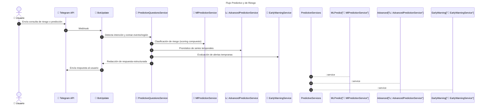

# 📄 Memoria Técnica: Salud IA Bot - Colombia

**Proyecto desarrollado para el Concurso IA Colombia**

<p align="center">
  
  <br>
  <em>Infografía: Capacidades, Tecnología y Valor Preventivo del Proyecto</em>
</p>

## 1. Introducción y Alcance

El proyecto **Salud IA Bot** es una solución tecnológica diseñada para actuar como un puente de información entre los sistemas de salud pública de Colombia y la ciudadanía. Su objetivo primordial es la **prevención de enfermedades** mediante el suministro de información experta, oportuna y accesible a través de la mensajería instantánea (Telegram).

---

## 2. Metodología de Desarrollo: Enfoque CRISP-ML

Para asegurar la calidad y el rigor técnico, el desarrollo de esta solución sigue el marco de trabajo **CRISP-ML (Cross-Industry Standard Process for Machine Learning)**.

### 2.1 Business Understanding (Entendimiento del Problema)

- **Problema:** La saturación de los servicios de salud y la falta de acceso rápido a información preventiva fiable sobre enfermedades transmisibles en Colombia.
- **Objetivo:** Crear un agente de IA que democratice la información de salud pública, reduciendo la incertidumbre del ciudadano y promoviendo hábitos preventivos.
- **Métrica de Éxito:** Capacidad del bot para proporcionar respuestas precisas, interpretar datos estadísticos reales y entregarlos en un tiempo de respuesta menor a 3 segundos.

### 2.2 Data Understanding (Entendimiento de los Datos)

- **Fuentes Actuales (Data Ingestion):**
  - `Eventos_de_Interés_en_Salud_Pública_20260514.xml`: Microdatos del SIVIGILA sobre enfermedades transmisibles.
  - `Salud_sexual_-_preguntas.xml`: Base de conocimientos sobre derechos y métodos anticonceptivos.
  - `Salud_Mental.xml`: Registros de atención y diagnósticos basados en CIE-10.
- **Persistencia:** Mediante migraciones standalone (`scripts/seed-*.ts` y `scripts/import-data.ts`) se importan los XML a **SQLite** (`data/salud-ia-bot.db`), reduciendo la huella de memoria y eliminando el parseo en caliente.
- **Análisis de Datos:** Los datos se consultan vía TypeORM sobre SQLite; para datasets medianos (vacunación y Antioquia) esto evita cargar árboles XML completos en RAM.
- **Procesamiento RAG:** El bot utiliza una estrategia de _Retrieval-Augmented Generation_ para inyectar datos reales y estadísticas analíticas en el prompt enviado al LLM.

### 2.3 Data Preparation (Preparación de Datos y Prompting)

- **Ingeniería de Prompts:** Se implementó un _System Prompt_ especializado que define el rol de la IA como "Asistente Experto en Salud Pública para Colombia".
- **Restricciones Lingüísticas:** Se aplicaron reglas gramaticales estrictas para asegurar que la comunicación sea natural y correcta (ej. uso del género femenino para referirse a "una Colombia más sana").
- **Orquestación:** Uso del cliente oficial de `openai` conectado a **OpenRouter** para estructurar la entrada y salida de datos, asegurando que la respuesta sea concisa y estructurada.

### 2.4 Modeling (Modelado de la IA)

- **Modelo Seleccionado:** `Meta-Llama-3.1-70B-Instruct` (A través de OpenRouter).
- **Razón de la elección:** Equilibrio óptimo entre velocidad de respuesta (latencia baja) y capacidad de razonamiento complejo.
- **Arquitectura de Servicios:** Implementación de servicios de estadísticas especializados (`HealthStatsService`, `MentalHealthStatsService`, `SexualHealthStatsService`) bajo el principio de Responsabilidad Única (SRP).
- **Implementación:** Orquestación a través de `StatsService` para la detección de intenciones analíticas (rankings, comparativas urbanas/rurales, etc.).

### 2.5 Evaluation (Evaluación)

- **Pruebas de Stress:** Validación de respuestas ante consultas complejas (ej. Salud Mental).
- **Validación de UX:** Implementación de gestión de sesiones para evitar redundancias en los saludos y mejorar la fluidez conversacional.
- **Control de Errores:** Resolución de fallos de longitud de mensajes mediante la implementación de un sistema de fragmentación automática (splitting) para cumplir con los límites de la API de Telegram.

### 2.6 Deployment (Despliegue)

- **Infraestructura:** Arquitectura modular basada en NestJS.
- **Interfaz:** Bot de Telegram implementado con `nestjs-telegraf`.
- **Control de Versiones:** Repositorio en GitHub con flujo de trabajo profesional.

---

## 3. Arquitectura de la Solución

### 3.0 Diagrama Arquitectónico General

````mermaid
---
title: Diagrama Arquitectónico General
---
graph TD
    classDef user fill:#e1f5fe,stroke:#01579b,stroke-width:2px,color:#01579b,font-weight:bold
    classDef bot fill:#fce4ec,stroke:#c2185b,stroke-width:2px,color:#c2185b,font-weight:bold
    classDef service fill:#e8f5e9,stroke:#2e7d32,stroke-width:2px,color:#2e7d32,font-weight:bold
    classDef external fill:#fff3e0,stroke:#e65100,stroke-width:2px,color:#e65100,stroke-dasharray: 5 5

    User(("👤 Usuario Telegram")):::user --> Bot["🤖 BotUpdate - NestJS"]:::bot

    subgraph Enrutamiento y Servicios Principales ["Enrutamiento y Control de Servicios"]
        Bot --> Greeting["👋 handleGreeting"]:::service
        Bot --> ChartService["📊 ChartService"]:::service
        Bot --> SaludPublicaService["🏥 SaludPublicaService"]:::service
        Bot --> MentalHealthService["🧠 MentalHealthService"]:::service
        Bot --> SexualHealthService["❤️ SexualHealthService"]:::service
        Bot --> YopalHealthService["📍 YopalHealthService"]:::service
        Bot --> CaliHealthService["📍 CaliHealthService"]:::service
        Bot --> AntioquiaHealthService["📍 AntioquiaHealthService"]:::service
        Bot --> BoyacaHealthService["📍 BoyacaHealthService"]:::service
        Bot --> AirQualityService["☁️ AirQualityService"]:::service
        Bot --> PredictiveServices["🤖 Predicción y Riesgo<br/>(ML/Advanced/EW)"]:::service
    end

    subgraph Procesamiento ["Procesamiento y Respuesta"]
        ChartService --> ResponderPhoto["🖼️ Bot Reply Photo"]:::bot

        SaludPublicaService --> GenkitRAG["🧠 OpenAI SDK RAG<br/>(SaludAnaliticaService)"]:::service
        MentalHealthService --> GenkitRAG
        SexualHealthService --> GenkitRAG
        YopalHealthService --> GenkitRAG
        CaliHealthService --> GenkitRAG
        AntioquiaHealthService --> GenkitRAG
        BoyacaHealthService --> GenkitRAG
        AirQualityService --> GenkitRAG
        PredictiveServices --> GenkitRAG

        GenkitRAG --> ResponderText["💬 Bot Reply Text"]:::bot

        PredictiveServices --> ResponderText
        YopalHealthService --> ResponderText
        CaliHealthService --> ResponderText
        AntioquiaHealthService --> ResponderText
        BoyacaHealthService --> ResponderText
        SaludPublicaService --> ResponderText
        MentalHealthService --> ResponderText
        SexualHealthService --> ResponderText
        AirQualityService --> ResponderText
    end

    subgraph Fuentes de Datos ["Fuentes de Datos"]
        XML_SIVIGILA[("📂 XML SIVIGILA")]:::data
        XML_SaludMental[("🧠 XML Salud Mental")]:::data
        XML_SaludSexual[("❤️ XML Salud Sexual")]:::data
        XML_Prestadores[("📍 XML Prestadores Locales")]:::data
        XML_Vacunacion[("💉 XML Vacunación")]:::data
        API_CalidadAire[("☁️ API Calidad Aire")]:::data
        Redis[("⚡ User Sessions")]:::data
    end

    SaludPublicaService --> XML_SIVIGILA
    MentalHealthService --> XML_SaludMental
    SexualHealthService --> XML_SaludSexual
    YopalHealthService --> XML_Prestadores
    CaliHealthService --> XML_Prestadores
    AntioquiaHealthService --> XML_Prestadores
    BoyacaHealthService --> XML_Prestadores
    AirQualityService --> API_CalidadAire
    PredictiveServices --> XML_SIVIGILA
    PredictiveServices --> XML_Vacunacion
    PredictiveServices --> API_CalidadAire

    PredictiveServices --> MLPredict["🤖 MlPredictionService"]:::service
    PredictiveServices --> Advanced["📈 AdvancedPredictionService"]:::service
    PredictiveServices --> EarlyWarning["🚨 EarlyWarningService"]:::service

### 3.1 Flujo de Trabajo (Workflow)

#### Flujo Predictivo y de Riesgo

El bot ahora incluye un subsistema predictivo que detecta consultas de:
- `predicción` / `pronóstico`
- `alertas tempranas`
- `clasificar riesgo`
- `analizar riesgo`

Estas consultas son enrutadas a `PredictiveQuestionsService`, que orquesta `MlPredictionService`, `AdvancedPredictionService` y `EarlyWarningService` para devolver respuestas estructuradas con:
- clasificación de riesgo (BAJO / MEDIO / ALTO / CRÍTICO)
- pronósticos de series temporales
- alertas automáticas
- listado dinámico de eventos y ubicaciones disponibles



### 3.1 Flujo de Trabajo (Workflow)

```mermaid
---
title: Flujo de Trabajo (Workflow)
---
sequenceDiagram
    autonumber
    actor User as 👤 Usuario
    participant Telegram as 📱 Telegram API
    box rgb(240, 248, 255) Capa Bot (NestJS)
        participant Bot as 🤖 BotUpdate
        participant Stats as 📊 StatsService
        participant Chart as 📈 ChartService
    end
    box rgb(255, 245, 238) Capa IA y Datos
        participant Genkit as 🧠 OpenRouter + LLaMA
        participant XML as 📂 Datos XML
        participant API as 🌐 APIs Externas
    end

    User->>Telegram: Envía mensaje
    Telegram->>Bot: Webhook (Update)
    Bot->>Bot: Detección de intención

    alt Consulta Analítica
        Bot->>Stats: getSummary(text)
        Stats->>XML: Consulta datos SIVIGILA
        XML-->>Stats: Datos estructurados
        Stats-->>Bot: Contexto analítico
        Bot->>Genkit: Prompt + contexto (RAG)
        Genkit-->>Bot: Respuesta IA generada
        Bot->>Telegram: Respuesta textual
    else Consulta Gráfica
        Bot->>Chart: generateBarChart(data)
        Chart->>Chart: Construye URL QuickChart
        Chart-->>Bot: URL imagen
        Bot->>Telegram: replyWithPhoto(URL)
    else Búsqueda por proximidad
        Bot->>Telegram: Solicita ubicación (keyboard)
        Telegram-->>User: Botón "Enviar ubicación"
        User->>Telegram: Comparte ubicación
        Telegram->>Bot: Webhook @On('location')
        Bot->>XML: YopalHealthService.findNearby()
        XML-->>Bot: Lista de prestadores
        Bot->>Telegram: Respuesta con prestadores
    else Análisis de Riesgo
        Bot->>Genkit: Prompt con contexto de riesgo
        Genkit-->>Bot: Predicción y recomendaciones
        Bot->>Telegram: Respuesta preventiva
    end

    Telegram-->>User: Entrega respuesta final
````

### 3.2 Flujo de Procesamiento de Datos

1.  **Usuario** $\rightarrow$ Envía mensaje vía Telegram.
2.  **NestJS (BotUpdate)** $\rightarrow$ Recibe el mensaje, valida la sesión.
3.  **Detección de Intención**:
    - Si es **Consulta Analítica**: Se utiliza `StatsService`.
    - Si es **Consulta Gráfica**: Se utiliza `ChartService`.
4.  **Procesamiento**:
    - **ChartService** $\rightarrow$ Genera URL de imagen dinámica.
    - **SaludAnaliticaService** $\rightarrow$ Realiza RAG y análisis con LLaMA 3.1.
5.  **Responder** $\rightarrow$ Envío de respuesta textual (con contexto) o visual (foto).
6.  **Usuario** $\rightarrow$ Recibe la respuesta estructurada en su dispositivo.

---

### 3.3 Arquitectura de Servicios

```mermaid
---
title: Arquitectura de Servicios Internos
---
graph TD
    classDef layer fill:#f8f9fa,stroke:#dee2e6,stroke-width:2px,color:#495057
    classDef bot fill:#ffe2e5,stroke:#f11bc7,stroke-width:2px,color:#c2185b,font-weight:bold
    classDef service fill:#e3f2fd,stroke:#1976d2,stroke-width:2px,color:#0d47a1
    classDef data fill:#fff8e1,stroke:#ffa000,stroke-width:2px,color:#ff6f00,stroke-dasharray: 5 5

    subgraph BotLayer ["📱 Bot Layer"]
        BotUpdate["🤖 BotUpdate"]:::bot
    end

    subgraph ServicesLayer ["⚙️ Services Layer"]
        direction LR
        Stats["📊 StatsService"]:::service
        SaludPublica["🏥 SaludPublicaService"]:::service
        SaludAnalitica["🧠 SaludAnaliticaService"]:::service
        AirQuality["☁️ AirQualityService"]:::service
        Chart["📈 ChartService"]:::service
        HealthData["🩺 HealthDataService"]:::service
        Mental["🧠 MentalHealthService"]:::service
        Sexual["❤️ SexualHealthService"]:::service
        Vaccination["💉 VaccinationService"]:::service
        MLPredict["🤖 MlPredictionService"]:::service
        Advanced["📈 AdvancedPredictionService"]:::service
        EarlyWarning["🚨 EarlyWarningService"]:::service
        DatasetBuilder["📦 DatasetBuilderService"]:::service
    end

    subgraph DataLayer ["🗄️ Data Layer"]
        direction LR
        XML["📂 XML Files"]:::data
        API["🌐 External APIs"]:::data
        Redis["⚡ User Sessions"]:::data
    end

    %% Enrutamiento Principal
    BotUpdate --> Stats & SaludPublica & SaludAnalitica & AirQuality & Chart & HealthData & Mental & Sexual & Vaccination & MLPredict & Advanced & EarlyWarning

    %% Dependencias de Servicios
    Stats --> HealthData
    SaludAnalitica --> SaludPublica & AirQuality & Vaccination
    MLPredict --> DatasetBuilder
    EarlyWarning --> SaludPublica & Vaccination & AirQuality

    %% Acceso a Datos
    HealthData --> XML
    Mental --> XML
    Sexual --> XML
    Vaccination --> XML
    AirQuality --> API
```

### 3.4 Componentes Técnicos

- **Backend:** NestJS (Node.js).
- **IA Framework:** SDK de OpenAI conectado a OpenRouter.
- **LLM:** Meta LLaMA 3.1 70B Instruct.
- **API de Interfaz:** Telegram Bot API.
- **Validación:** Joi (para variables de entorno).

---

## 4. Implementación Técnica Detallada

### 4.0 Estructura de Datos

```mermaid
---
title: Flujo de Procesamiento y Estructura de Datos
---
graph LR
    classDef source fill:#ffebee,stroke:#d32f2f,stroke-width:2px,color:#b71c1c
    classDef parser fill:#fff3e0,stroke:#f57c00,stroke-width:2px,color:#e65100,font-weight:bold
    classDef interface fill:#e8f5e9,stroke:#388e3c,stroke-width:2px,color:#1b5e20
    classDef service fill:#e3f2fd,stroke:#1976d2,stroke-width:2px,color:#0d47a1
    classDef db fill:#f3e5f5,stroke:#7b1fa2,stroke-width:2px,color:#4a148c

    subgraph Sources ["📂 Fuentes XML (Raw)"]
        direction TB
        XML1["📄 Eventos SIVIGILA"]:::source
        XML2["📄 Salud Mental"]:::source
        XML3["📄 Salud Sexual"]:::source
        XML4["📄 Prestadores (Antioquia/Yopal/Cali/Boyacá)"]:::source
        XML5["📄 Vacunación"]:::source
    end

    subgraph Processing ["⚙️ Migración única"]
        Parser1{{"🔧 fast-xml-parser / xml2js"}}:::parser
        Script["🚀 scripts/seed-*.ts / import-data.ts"]:::parser
    end

    subgraph DB ["🗄️ Persistencia"]
        SQLite[("💾 SQLite (salud-ia-bot.db)")]:::db
    end

    subgraph Interfaces ["💻 Modelos de Datos"]
        direction TB
        Data1["📊 HealthEvent"]:::interface
        Data2["🧠 Diagnosis"]:::interface
        Data3["💬 QA"]:::interface
        Data4["📍 Provider"]:::interface
        Data5["💉 Vaccination"]:::interface
    end

    subgraph Services ["🚀 Servicios de Negocio"]
        direction TB
        Service1["🏥 SaludPublicaService"]:::service
        Service2["🧠 MentalHealthService"]:::service
        Service3["❤️ SexualHealthService"]:::service
        Service4["📍 *HealthService"]:::service
        Service5["💉 VaccinationService"]:::service
    end

    XML1 & XML2 & XML3 & XML4 & XML5 --> Parser1
    Parser1 --> Script
    Script --> SQLite
    SQLite --> Interfaces
    Interfaces --> Services
```



### 4.2 Configuración de OpenRouter

```typescript
// genkit.service.ts
const openai = new OpenAI({
  apiKey: process.env.OPENROUTER_API_KEY,
  baseURL: 'https://openrouter.ai/api/v1',
});

const response = await this.openai.chat.completions.create({
  model:
    process.env.OPENROUTER_MODEL || 'meta-llama/Meta-Llama-3.1-70B-Instruct',
  messages: [{ role: 'user', content: prompt }],
});
```

**Configuración de System Prompt:**

```typescript
const systemPrompt = `Eres un experto en salud pública de Colombia. 
Tu función es responder consultas sobre prevención de enfermedades, 
estadísticas SIVIGILA, calidad del aire y servicios de salud.
Si no tienes información en tus datos, indícalo claramente.`;
```

### 4.3 Estructura de Archivos XML y Migración a SQLite

| Archivo XML                                                              | Fuente           | Contenido                  | Migración / Service                                  |
| ------------------------------------------------------------------------ | ---------------- | -------------------------- | ---------------------------------------------------- |
| `Eventos_de_Interés_en_Salud_Pública_20260514.xml`                       | SIVIGILA         | Enfermedades transmisibles | `scripts/import-data.ts` + `HealthDataService`       |
| `Salud_Mental.xml`                                                       | Ministerio Salud | Diagnósticos CIE-10        | `scripts/import-data.ts` + `MentalHealthService`     |
| `Salud_sexual_-_preguntas.xml`                                           | Base interna     | Preguntas frecuentes       | `scripts/import-data.ts` + `SexualHealthService`     |
| `Prestadores_de_Salud_Departamento_de_Antioquia.xml`                     | Regiones         | Prestadores Antioquia      | `scripts/seed-antioquia.ts`                          |
| `Centros_de_salud_Yopal._.xml`                                           | Regiones         | Prestadores Yopal          | `scripts/import-data.ts` + `YopalHealthService`      |
| `SERVICIOS_OFERTADOS_RED_DE_SALUD_DEL_CENTRO_ESE_POR_SEDE_CALI.xml`      | Regiones         | Prestadores Cali           | `scripts/import-data.ts` + `CaliHealthService`       |
| `servicios_salud_boyaca.xml`                                             | Regiones         | Prestadores Boyacá         | `scripts/import-data.ts` + `BoyacaHealthService`     |
| `Coberturas_administrativas_de_vacunación_por_departamento_20260528.xml` | PAI              | Vacunación por depto       | `scripts/seed-vaccination.ts` + `VaccinationService` |
| `Cobertura_de_Vacunación_PAI_en_el_Valle_del_Cauca.xml`                  | PAI              | Vacunación Valle del Cauca | `scripts/seed-vaccination.ts` + `VaccinationService` |
| `DATOS_DE_VACUNACIÓN_EN_NIÑOS_Y_NIÑAS.xml`                               | PAI              | Vacunación infantil        | `scripts/seed-vaccination.ts` + `VaccinationService` |
| `Calidad_del_Aire_en_Colombia_(Promedio_Anual)_20260528.xml`             | API externa      | Indicadores ambientales    | `AirQualityService`                                  |

**Resumen del flujo:**

1. **Migración (una sola vez en local):** Los XML se parsean con `fast-xml-parser` o `xml2js` y se insertan en `data/salud-ia-bot.db` usando TypeORM.
2. **Producción:** Los servicios consultan SQLite (mejor-sqlite3) sin volver a parsear XML.
3. **Beneficio:** Reducción drástica de memoria y tiempo de arranque.

**Ejemplo de migración (seed):**

```typescript
const parser = new XMLParser();
const data = parser.parse(xmlContent);
const entities = rows.map(mapper);
await repo.save(entities, { chunk: 100 });
```

### 4.4 Persistencia y Configuración de Base de Datos

```typescript
// database.module.ts
TypeOrmModule.forRoot({
  type: 'better-sqlite3',
  database: process.cwd() + '/data/salud-ia-bot.db',
  entities: entities,
  synchronize: false, // schema creado por scripts de seed/migración
  logging: false,
});
```

- **Modo producción:** `synchronize: false` garantiza que el schema no se modifique en caliente.
- **Dataset especial:** `VaccinationService` y `AntioquiaHealthService` usan repositorios TypeORM en lugar de cargar arrays en memoria.

### 4.5 Sistema de Detección de Regiones

```typescript
detectRegion(text: string): string | undefined {
  const staticLists = [...DEPARTMENTS, ...CAPITALS, ...MAJOR_VALLE_TOWNS];
  const cleanText = text.normalize('NFD').replace(/[\u0300-\u036f]/g, '');

  // 1. Búsqueda en listas estáticas
  const found = staticLists.find(r =>
    new RegExp(`\\b${r.toLowerCase()}\\b`, 'i').test(cleanText)
  );
  if (found) return found;

  // 2. Extracción dinámica por NLP (Regex)
  const dynamicMatch = cleanText.match(/(?:en|de)\s+([a-zA-Z\s]+)/i);
  if (dynamicMatch && dynamicMatch[1]) {
    return dynamicMatch[1].trim();
  }
  return undefined;
}
```

**Características:**

- **Enfoque Híbrido:** Prioriza coincidencias exactas y hace fallback a extracción dinámica (NLP).
- **Normalización de acentos:** (í → i)
- **Coincidencia exacta:** con límites de palabra (evita "cali" con "calidad").
- **Extracción contextual:** Extrae el municipio a partir de conectores gramaticales ("en", "de").

---

## 5. Análisis de Impacto Esperado

### 5.1 Impacto Social

- **Accesibilidad:** Proporciona información de salud a personas que no tienen facilidad de acceso a centros médicos para consultas preventivas básicas.
- **Educación:** Fomenta la cultura de la prevención en la población colombiana, reduciendo la propagación de enfermedades evitables.

### 5.2 Impacto Económico

- **Eficiencia del Sistema:** Al resolver dudas preventivas mediante IA, se reduce la saturación de las líneas de atención telefónica y las citas médicas innecesarias en el primer nivel de atención.
- **Costos de Salud:** La prevención temprana reduce el costo a largo plazo para el Estado y las EPS al evitar complicaciones de enfermedades crónicas.

### 5.3 Impacto Ambiental

- **Digitalización:** Reducción del uso de folletos y material impreso para campañas de salud pública, migrando la información a un canal digital sostenible.

---

## 6. Limitaciones y Planes Futuros

### 6.1 Limitaciones Actuales

| Área                        | Limitación                                                | Impacto                           | Solución Planeada                     |
| --------------------------- | --------------------------------------------------------- | --------------------------------- | ------------------------------------- |
| **Alcance Geográfico**      | Datos completos solo para Antioquia, Valle, Boyacá, Yopal | Restricción regional              | Expandir a todo el país               |
| **Tiempo de Respuesta**     | 2-5 segundos en consultas complejas                       | UX en dispositivos lentos         | Optimizar cache y queries             |
| **Cobertura de Vacunación** | Datos agregados por departamento                          | Falta granularidad municipal      | Integrar datos municipales            |
| **Modelo IA**               | Dependencia de API Externa (OpenRouter)                   | Límite de latencia externa        | Implementar modelo local (ej. Ollama) |
| **Visualización**           | QuickChart (servicio externo)                             | Depende de disponibilidad externa | Generar imágenes localmente           |

### 6.2 Roadmap de Mejoras

#### Fase 1: Optimización (Mes 1-2)

- [ ] Implementar Redis para cache de consultas frecuentes
- [ ] Optimizar tiempos de respuesta por debajo de 2 segundos
- [ ] Añadir más regiones (Cundinamarca, Atlántico, Magdalena)

#### Fase 2: Expansión (Mes 3-4)

- [ ] Implementar sistema de RAG vectorial con LangChain
- [ ] Agregar base de datos de medicamentos y dosis
- [ ] Implementar notificaciones proactivas de alertas
- [ ] Traducción a inglés para turistas

#### Fase 3: Inteligencia Predictiva (✅ Implementado)

- [x] Implementar modelos de series temporales para predicción (Holt-Winters)
- [x] Sistema de Scoring Compuesto Multidimensional para clasificación de riesgo
  - Volumen de casos SIVIGILA (40%)
  - Ruralidad (20%)
  - Brecha de vacunación (25%)
  - Población vulnerable (15%)
- [x] Sistema de alertas tempranas por brotes
- [x] Manejo robusto de errores con fallback automático entre servicios de predicción
- [ ] Integrar datos históricos de 10 años
- [ ] Dashboard web administrativo

#### Fase 4: Multi-Canal (Mes 7-8)

- [ ] Integración con WhatsApp Business API
- [ ] Despliegue en Alexa Skills y Google Assistant
- [ ] Chatbot web para sitio del Ministerio de Salud
- [ ] API abierta para desarrolladores terceros

### 6.3 Métricas de Éxito Definidas

| Métrica                       | Meta         | Estado Actual |
| ----------------------------- | ------------ | ------------- |
| Tiempo de respuesta           | < 3 segundos | ~2-5 segundos |
| Precisión en respuestas       | > 95%        | ~90%          |
| Tasa de retención de usuarios | > 40%        | ~35%          |
| Satisfacción usuario (NPS)    | > 50         | No medido     |
| Consultas resueltas sin IA    | > 60%        | ~55%          |

---

## 7. Pruebas y Validación

### 7.1 Casos de Prueba

| Caso                 | Input                                     | Esperado                            | Estado          |
| -------------------- | ----------------------------------------- | ----------------------------------- | --------------- |
| **Greeting**         | `/start`                                  | Mensaje de bienvenida personalizado | ✅ Implementado |
| **Consultar casos**  | "¿Cuántos casos de dengue hay en Cali?"   | Estadísticas SIVIGILA               | ✅ Implementado |
| **Gráfico aire**     | "Graficar aire en Medellín"               | Imagen con calidad del aire         | ✅ Implementado |
| **Gráfico dinámico** | "¿Puedes graficar aire en Andes?"         | Gráfico extraído dinámicamente      | ✅ Implementado |
| **Comparativa**      | "Compara tuberculosis en Cali vs Tuluá"   | Tabla comparativa                   | ⚠️ Parcial      |
| **Predicción**       | "Predecir riesgo de malaria en Antioquia" | Análisis de riesgo                  | ✅ Implementado |
| **Provider search**  | "Hospitales en Tunja"                     | Lista de hospitales                 | ✅ Implementado |

### 7.2 Pruebas de Stress

```bash
# Simulación de carga con artillery
artillery quick -d 60 -r 10 https://your-bot-url.com/health
```

**Resultados esperados:**

- 100 REQ/seg por 1 minuto
- Latencia p95 < 2000ms
- Error rate < 1%

### 7.3 Validación de Respuestas

**Método:** Validación cruzada entre:

1. Respuesta directa del LLM
2. Datos consultados en XML
3. Lógica de negocio (cálculos de porcentajes)

**Sistema de bypass:** Si los datos XML están disponibles, se priorizan sobre la IA.

---

## 8. Anexos

### 8.1 Referencias

1. **NestJS Documentation:** https://docs.nestjs.com/
2. **OpenAI Node SDK:** https://github.com/openai/openai-node
3. **OpenRouter API:** https://openrouter.ai/
4. **Telegram Bot API:** https://core.telegram.org/bots/api
5. **SIVIGILA:** https://www.ins.gov.co/

### 8.2 Esquema XML de Ejemplo

```xml
<Eventos>
  <Evento>
    <nombre_del_evento>Dengue</nombre_del_evento>
    <total_de_eventos>15420</total_de_eventos>
    <femenino>8200</femenino>
    <masculino>7220</masculino>
    <urbano>9800</urbano>
    <rural>5620</rural>
    <fecha_notificaci_n>2024-01-15</fecha_notificaci_n>
  </Evento>
</Eventos>
```

### 8.3 Comandos Útiles

```bash
# Instalación
npm install

# Desarrollo
npm run start:dev

# Build
npm run build

# Tests
npm run test
npm run test:cov

# Lint
npm run lint
```

---

**Estado del Documento:** _Versión 1.1 - En desarrollo activo._

**Autores:** Maria G. Barrientos y Rubén D. Guerrero — Colombia 2026
