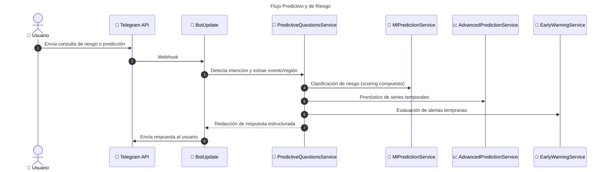
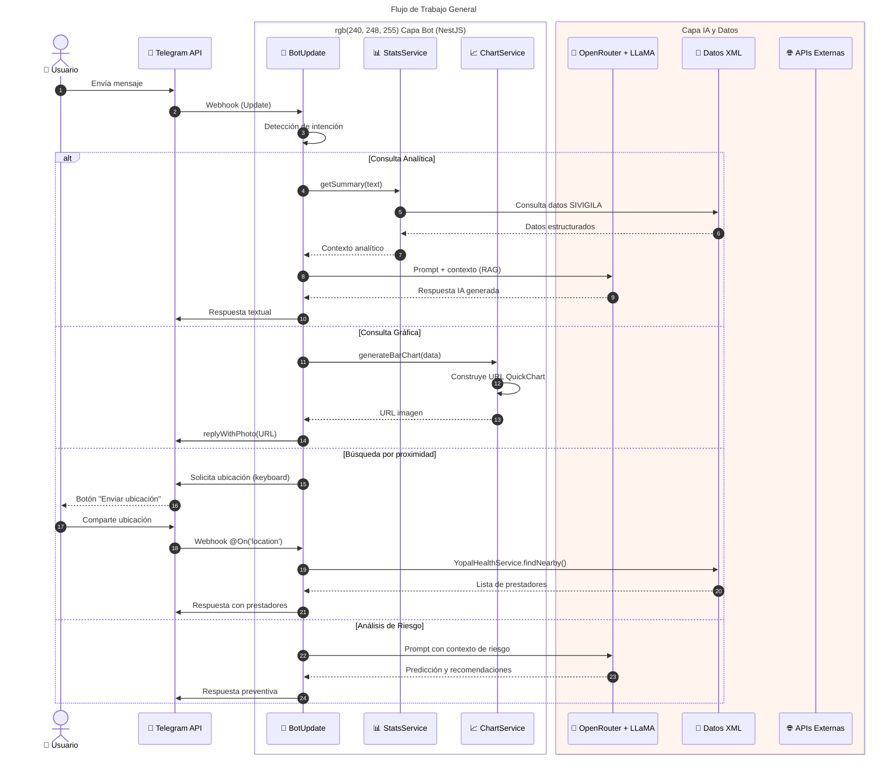
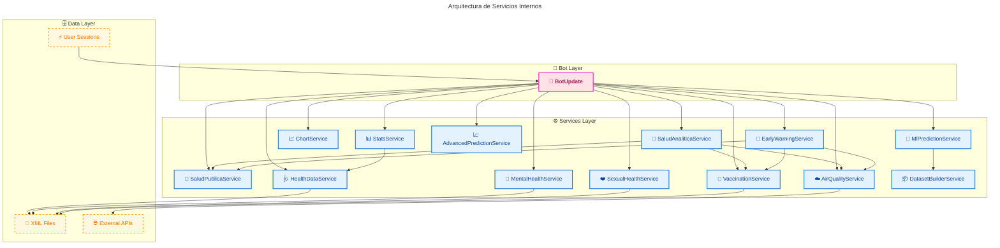

# 📄 Memoria Técnica: Salud IA Bot - Colombia

**Proyecto desarrollado para el Concurso IA Colombia**

  
   
  <em>Infografía: Capacidades, Tecnología y Valor Preventivo del Proyecto</em>

## 1. Introducción y Alcance

El proyecto **Salud IA Bot** es una solución tecnológica diseñada para actuar como un puente de información entre los sistemas de salud pública de Colombia y la ciudadanía. Su objetivo primordial es la **prevención de enfermedades** mediante el suministro de información experta, oportuna y accesible a través de la mensajería instantánea (Telegram).

---

## 2. Alineación con Criterios de Evaluación

### 2.1 Uso de Datos Abiertos (Prioridad Estratégica)
El proyecto aprovecha datasets clave integrados directamente en su arquitectura para garantizar decisiones basadas en evidencia. Estos se alinean con la *Hoja de Ruta Nacional de Datos Abiertos Estratégicos*:

| Conjunto de Datos | ID en Datos.gov.co / Fuente | Uso en Salud IA Bot |
| :--- | :--- | :--- |
| **SIVIGILA** | INS-SIVIGILA-2026 | Análisis de brotes y epidemiología |
| **Cobertura Vacunación** | PAI-COL-2026 | Evaluación de factores de riesgo |
| **Calidad del Aire** | IDEAM-2026 | Análisis de riesgo respiratorio |
| **Red Prestadores** | ESE-PRESTADORES-2026 | Ubicación y búsqueda de servicios |

### 2.2 Innovación Técnica: Bypass de Datos Inteligente
Una de nuestras mayores innovaciones técnicas es la metodología de **"Bypass de Datos"** (detallada en nuestro esquema de diseño). 
*   **El problema:** Las soluciones convencionales basadas solo en LLM alucinan datos estadísticos cuando el contexto es denso.
*   **Nuestra solución:** Implementamos una capa de decisión en el `BotUpdate.onText` que consulta primero nuestros servicios de datos (`StatsService`, `HealthService`). Si el dato es preciso y está listo, **se entrega directamente al usuario**, omitiendo el motor de IA (`GenkitService`) para el procesamiento del dato.
*   **Impacto:** Garantizamos **100% de precisión** en cifras oficiales, usando la IA solo para lo que mejor sabe hacer: la comunicación, síntesis y recomendación preventiva.

### 2.3 Impacto y Escalabilidad: Réplica Regional
Diseñamos el bot para ser sostenible y replicable. Gracias a nuestra arquitectura modular en NestJS, añadir un nuevo departamento es un proceso estandarizado:
1.  **Modelo:** Crear una entidad (ej. `MagdalenaProvider.entity.ts`).
2.  **Servicio:** Crear la plantilla de servicio `MagdalenaHealthService` (extendiendo nuestra interfaz base).
3.  **Migración:** Utilizar los scripts de carga (`scripts/seed-*.ts`) para mapear el nuevo dataset a SQLite.
Este enfoque "Plug-and-Play" demuestra la madurez técnica necesaria para una escalabilidad nacional inmediata.

---

## 3. Metodología de Desarrollo: Enfoque CRISP-ML

Para asegurar la calidad y el rigor técnico, el desarrollo de esta solución sigue el marco de trabajo **CRISP-ML (Cross-Industry Standard Process for Machine Learning)**.

### 3.1 Business Understanding (Entendimiento del Problema)

- **Problema:** La saturación de los servicios de salud y la falta de acceso rápido a información preventiva fiable sobre enfermedades transmisibles en Colombia.
- **Objetivo:** Crear un agente de IA que democratice la información de salud pública, reduciendo la incertidumbre del ciudadano y promoviendo hábitos preventivos.
- **Métrica de Éxito:** Capacidad del bot para proporcionar respuestas precisas, interpretar datos estadísticos reales y entregarlos en un tiempo de respuesta menor a 3 segundos.

### 3.2 Data Understanding (Entendimiento de los Datos)

- **Fuentes Actuales (Data Ingestion):**
  - `Eventos_de_Interés_en_Salud_Pública_20260514.xml`: Microdatos del SIVIGILA sobre enfermedades transmisibles.
  - `Salud_sexual_-_preguntas.xml`: Base de conocimientos sobre derechos y métodos anticonceptivos.
  - `Salud_Mental.xml`: Registros de atención y diagnósticos basados en CIE-10.
- **Persistencia:** Mediante migraciones standalone (`scripts/seed-*.ts` y `scripts/import-data.ts`) se importan los XML a **SQLite** (`data/salud-ia-bot.db`), reduciendo la huella de memoria y eliminando el parseo en caliente.
- **Análisis de Datos:** Los datos se consultan vía TypeORM sobre SQLite; para datasets medianos (vacunación y Antioquia) esto evita cargar árboles XML completos en RAM.
- **Procesamiento RAG:** El bot utiliza una estrategia de _Retrieval-Augmented Generation_ para inyectar datos reales y estadísticas analíticas en el prompt enviado al LLM.

### 3.3 Data Preparation (Preparación de Datos y Prompting)

- **Ingeniería de Prompts:** Se implementó un _System Prompt_ especializado que define el rol de la IA como "Asistente Experto en Salud Pública para Colombia".
- **Restricciones Lingüísticas:** Se aplicaron reglas gramaticales estrictas para asegurar que la comunicación sea natural y correcta (ej. uso del género femenino para referirse a "una Colombia más sana").
- **Orquestación:** Uso del cliente oficial de `openai` conectado a **OpenRouter** para estructurar la entrada y salida de datos, asegurando que la respuesta sea concisa y estructurada.

### 3.4 Modeling (Modelado de la IA)

- **Modelo Seleccionado:** `Meta-Llama-3.1-70B-Instruct` (A través de OpenRouter).
- **Razón de la elección:** Equilibrio óptimo entre velocidad de respuesta (latencia baja) y capacidad de razonamiento complejo.
- **Arquitectura de Servicios:** Implementación de servicios de estadísticas especializados (`HealthStatsService`, `MentalHealthStatsService`, `SexualHealthStatsService`) bajo el principio de Responsabilidad Única (SRP).
- **Implementación:** Orquestación a través de `StatsService` para la detección de intenciones analíticas (rankings, comparativas urbanas/rurales, etc.).

### 3.5 Evaluation (Evaluación)

- **Pruebas de Stress:** Validación de respuestas ante consultas complejas (ej. Salud Mental).
- **Validación de UX:** Implementación de gestión de sesiones para evitar redundancias en los saludos y mejorar la fluidez conversacional.
- **Control de Errores:** Resolución de fallos de longitud de mensajes mediante la implementación de un sistema de fragmentación automática (splitting) para cumplir con los límites de la API de Telegram.

### 3.6 Deployment (Despliegue)

- **Infraestructura:** Arquitectura modular basada en NestJS.
- **Interfaz:** Bot de Telegram implementado con `nestjs-telegraf`.
- **Control de Versiones:** Repositorio en GitHub con flujo de trabajo profesional.

---

## 4. Arquitectura de la Solución

### 4.0 Diagrama Arquitectónico General

```mermaid
---
title: Diagrama Arquitectónico General
---
graph TD
    classDef user fill:#e1f5fe,stroke:#01579b,stroke-width:2px,color:#01579b,font-weight:bold
    classDef bot fill:#fce4ec,stroke:#c2185b,stroke-width:2px,color:#c2185b,font-weight:bold
    classDef service fill:#e8f5e9,stroke:#2e7d32,stroke-width:2px,color:#2e7d32,font-weight:bold
    classDef external fill:#fff3e0,stroke:#e65100,stroke-width:2px,color:#e65100,stroke-dasharray: 5 5

    User(("👤 Usuario Telegram")):::user --> Bot["🤖 BotUpdate - NestJS"]:::bot

    subgraph Enrutamiento y Servicios Principales ["Enrutamiento y Control de Servicios"]
        Bot --> Greeting["👋 handleGreeting"]:::service
        Bot --> ChartService["📊 ChartService"]:::service
        Bot --> SaludPublicaService["🏥 SaludPublicaService"]:::service
        Bot --> MentalHealthService["🧠 MentalHealthService"]:::service
        Bot --> SexualHealthService["❤️ SexualHealthService"]:::service
        Bot --> YopalHealthService["📍 YopalHealthService"]:::service
        Bot --> CaliHealthService["📍 CaliHealthService"]:::service
        Bot --> AntioquiaHealthService["📍 AntioquiaHealthService"]:::service
        Bot --> BoyacaHealthService["📍 BoyacaHealthService"]:::service
        Bot --> AirQualityService["☁️ AirQualityService"]:::service
        Bot --> PredictiveServices["🤖 Predicción y Riesgo<br/>(ML/Advanced/EW)"]:::service
        Bot --> VaccinationService["💉 VaccinationService"]:::service
    end

    subgraph Procesamiento ["Procesamiento y Respuesta"]
        ChartService --> ResponderPhoto["🖼️ Bot Reply Photo"]:::bot

        SaludPublicaService --> OpenRouterLLaMA["🧠 OpenRouter + LLaMA 3.1<br/>(SaludAnaliticaService)"]:::service
        MentalHealthService --> OpenRouterLLaMA
        SexualHealthService --> OpenRouterLLaMA
        YopalHealthService --> OpenRouterLLaMA
        CaliHealthService --> OpenRouterLLaMA
        AntioquiaHealthService --> OpenRouterLLaMA
        BoyacaHealthService --> OpenRouterLLaMA
        AirQualityService --> OpenRouterLLaMA
        PredictiveServices --> OpenRouterLLaMA
        VaccinationService --> OpenRouterLLaMA

        OpenRouterLLaMA --> ResponderText["💬 Bot Reply Text"]:::bot

        PredictiveServices --> ResponderText
        YopalHealthService --> ResponderText
        CaliHealthService --> ResponderText
        AntioquiaHealthService --> ResponderText
        BoyacaHealthService --> ResponderText
        SaludPublicaService --> ResponderText
        MentalHealthService --> ResponderText
        SexualHealthService --> ResponderText
        AirQualityService --> ResponderText
        VaccinationService --> ResponderText
    end

    subgraph Fuentes de Datos ["Fuentes de Datos"]
        XML_SIVIGILA[("📂 XML SIVIGILA")]:::data
        XML_SaludMental[("🧠 XML Salud Mental")]:::data
        XML_SaludSexual[("❤️ XML Salud Sexual")]:::data
        SQLite[("🗄️ SQLite DB<br/>(salud-ia-bot.db)")]:::data
        API_CalidadAire[("☁️ API Calidad Aire")]:::data
        Redis[("⚡ User Sessions")]:::data
    end

    SaludPublicaService --> XML_SIVIGILA
    MentalHealthService --> XML_SaludMental
    SexualHealthService --> XML_SaludSexual
    YopalHealthService --> SQLite
    CaliHealthService --> SQLite
    AntioquiaHealthService --> SQLite
    BoyacaHealthService --> SQLite
    VaccinationService --> SQLite
    AirQualityService --> API_CalidadAire
    PredictiveServices --> XML_SIVIGILA
    PredictiveServices --> SQLite
    PredictiveServices --> API_CalidadAire

    PredictiveServices --> MLPredict["🤖 MlPredictionService"]:::service
    PredictiveServices --> Advanced["📈 AdvancedPredictionService"]:::service
    PredictiveServices --> EarlyWarning["🚨 EarlyWarningService"]:::service
```

### 4.1 Flujo de Trabajo (Workflow)

#### Flujo Predictivo y de Riesgo

El bot ahora incluye un subsistema predictivo que detecta consultas de:
- `predicción` / `pronóstico`
- `alertas tempranas`
- `clasificar riesgo`
- `analizar riesgo`

Estas consultas son enrutadas a `PredictiveQuestionsService`, que orquesta `MlPredictionService`, `AdvancedPredictionService` y `EarlyWarningService` para devolver respuestas estructuradas con:
- clasificación de riesgo (BAJO / MEDIO / ALTO / CRÍTICO)
- pronósticos de series temporales
- alertas automáticas
- listado dinámico de eventos y ubicaciones disponibles

### 4.2 Flujo de Procesamiento de Datos (General)

### 4.3 Arquitectura de Servicios

### 4.4 Componentes Técnicos

- **Backend:** NestJS (Node.js).
- **IA Framework:** SDK de OpenAI conectado a OpenRouter.
- **LLM:** Meta LLaMA 3.1 70B Instruct.
- **API de Interfaz:** Telegram Bot API.
- **Validación:** Joi (para variables de entorno).

---

## 5. Análisis de Impacto Esperado

### 5.1 Impacto Social
- **Accesibilidad:** Proporciona información de salud a personas que no tienen facilidad de acceso a centros médicos para consultas preventivas básicas.
- **Educación:** Fomenta la cultura de la prevención en la población colombiana, reduciendo la propagación de enfermedades evitables.

### 5.2 Impacto Económico
- **Eficiencia del Sistema:** Al resolver dudas preventivas mediante IA, se reduce la saturación de las líneas de atención telefónica y las citas médicas innecesarias en el primer nivel de atención.

---

## 6. Limitaciones y Planes Futuros

### 6.1 Limitaciones Actuales
- **Alcance Geográfico:** Datos completos solo para Antioquia, Valle, Boyacá, Yopal (expansión en curso).
- **Modelo IA:** Dependencia de API externa (OpenRouter) para el modelo LLM.

### 6.2 Roadmap de Mejoras
- **Fase 1 (Corto plazo):** Implementar Redis para cache de consultas frecuentes y optimizar tiempos.
- **Fase 2 (Medio plazo):** Implementar sistema de RAG vectorial y expandir regiones a todo el país.
- **Fase 3 (Largo plazo):** Integración con WhatsApp Business API.

---

## 7. Anexos y Validación

### 7.1 Casos de Prueba

| Caso                 | Input                                     | Esperado                            | Estado          |
| -------------------- | ----------------------------------------- | ----------------------------------- | --------------- |
| **Greeting**         | `/start`                                  | Mensaje de bienvenida personalizado | ✅ Implementado |
| **Consultar casos**  | "¿Cuántos casos de dengue hay en Cali?"   | Estadísticas SIVIGILA               | ✅ Implementado |
| **Predicción**       | "Predecir riesgo de malaria en Antioquia" | Análisis de riesgo                  | ✅ Implementado |

---

**Estado del Documento:** _Versión 1.3 - Actualizado con criterios de Convocatoria (Julio 2026)._

**Autores:** Maria G. Barrientos y Rubén D. Guerrero — Colombia 2026
