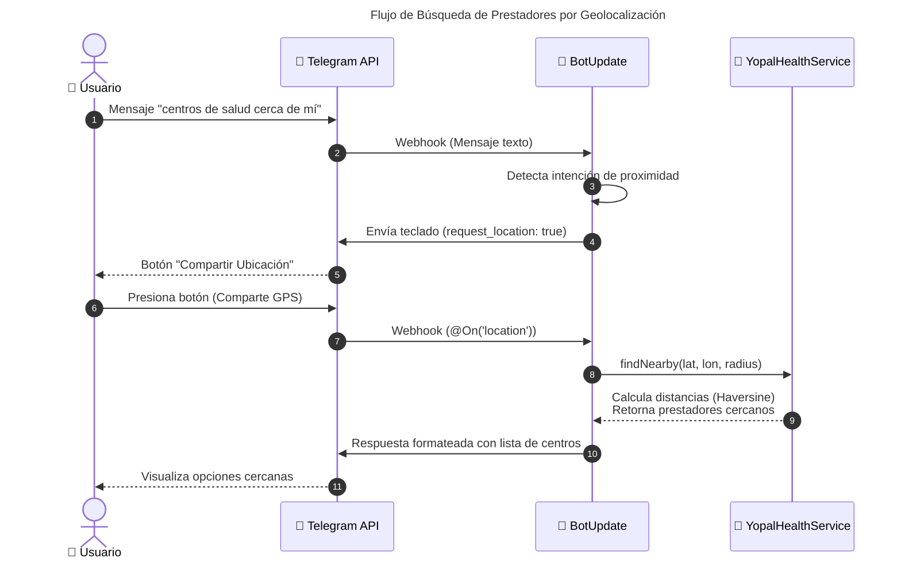

# FUNCIONALIDAD TÉCNICA - Módulo Salud Pública

## Descripción

El servicio `SaludPublicaService` es un motor de análisis epidemiológico basado en datos estructurados (XML). Permite consultas analíticas, comparativas y estadísticas sin depender de modelos generativos (Genkit) para datos precisos, garantizando veracidad y evitando alucinaciones.

## Arquitectura del Servicio

```mermaid
---
title: Arquitectura de SaludPublicaService
---
graph TD
    classDef user fill:#e1f5fe,stroke:#01579b,stroke-width:2px,color:#01579b
    classDef router fill:#fce4ec,stroke:#c2185b,stroke-width:2px,color:#c2185b,font-weight:bold
    classDef core fill:#e8f5e9,stroke:#2e7d32,stroke-width:2px,color:#2e7d32
    classDef rag fill:#fff3e0,stroke:#e65100,stroke-width:2px,color:#e65100
    classDef data fill:#f3e5f5,stroke:#7b1fa2,stroke-width:2px,color:#4a148c

    User(("👤 Usuario Telegram")):::user --> Router{"🤖 BotUpdate.onText"}:::router
    Router -->|Ruta Directa| Publica["🏥 SaludPublicaService"]:::core
    Router -->|Ruta IA| RAG["🧠 Genkit RAG"]:::rag

    subgraph Motor ["⚙️ Motor de Análisis (SaludPublicaService)"]
        direction TB
        Normalizer["🔤 Normalización de Texto"]:::core
        SearchEngine["🔍 Motor de Búsqueda<br/>Sinónimos"]:::core
        Analytics["📈 Análisis Estadístico<br/>Ranking, Zona, Sexo, Edad"]:::core
        NLG["💬 Generador de Respuestas<br/>NLG Estructurado"]:::core

        Normalizer --> SearchEngine --> Analytics --> NLG
    end

    Publica --> Normalizer

    Analytics -->|Consulta O(1)| Data[("📂 XML SIVIGILA")]:::data
```

## Geolocalización (Búsqueda por proximidad)

Se implementó un flujo de proximidad que detecta consultas tipo "cerca de mí" y solicita la ubicación al usuario mediante un teclado con `request_location: true`. El estado de conversación utiliza la clave `provider_search_location` en `userState` para continuar el flujo cuando se recibe la ubicación.

- Funciones clave:
  - `isNearbyLocationQuery(text: string): boolean` — detecta frases de proximidad.
  - `requestLocationForNearbyProviders(ctx, userId?)` — envía un teclado de Telegram que solicita ubicación.
  - `@On('location') onLocation(ctx)` — maneja la ubicación recibida y llama a `YopalHealthService.findNearby(lat, lon, radiusKm)`.



## Métodos Clave

1. **`procesarPregunta(texto)`**: Router de intenciones que clasifica la consulta y delega al análisis correspondiente o al fallback/ambigüedad.
2. **`buscarEventosAmbigua(nombre)`**: Motor de búsqueda con soporte de sinónimos y resolución de coincidencias múltiples.
3. **`topEventos(n)` / `bottomEventos(n)`**: Rankings de incidencia epidemiológica.
4. **`eventosPorRango(min, max)`**: Filtro estadístico avanzado.
5. **`procesarPreguntaCompleja(texto)`**: Motor de análisis para comparativas directas (ej: Dengue vs Chikungunya).
6. **`_formatearRespuesta(datos, tipo)`**: Motor de generación de lenguaje natural (NLG) que asegura salidas coherentes y con contexto (porcentajes, emojis, conclusiones).

## Módulo Predictivo y de Riesgo

El servicio `BotUpdate` enruta las consultas de riesgo y predicción a `PredictiveQuestionsService`, que actúa como orquestador para:

- `MlPredictionService`: cálculo de riesgo con scoring compuesto multidimensional.
- `AdvancedPredictionService`: pronósticos de series temporales y tendencias.
- `EarlyWarningService`: detección de alertas tempranas y umbrales críticos.
- `DatasetBuilderService`: tubería de datos que limpia y normaliza fuentes (XML, APIs externas) para alimentar los modelos.

### Flujo de Consulta Predictiva

1. Usuario solicita: `predecir riesgo`, `pronóstico`, `alertas tempranas` o `clasificar riesgo`.
2. `BotUpdate` detecta intención y extrae evento y región.
3. `PredictiveQuestionsService` coordina:
   - `MlPredictionService` para clasificación de riesgo.
   - `AdvancedPredictionService` para proyección de casos.
   - `EarlyWarningService` para generación de alertas.
   - `DatasetBuilderService` prepara tensores y vectores normalizados desde múltiples fuentes (SIVIGILA, vacunación, calidad del aire).
4. Se devuelve una respuesta estructurada con puntajes, recomendaciones y contexto.

## Módulos de Inteligencia Predictiva (Machine Learning)

El proyecto ha incorporado modelos predictivos y algoritmos nativos (sin dependencia exclusiva de LLMs) para calcular riesgos, proyecciones y alertas:

1. **`MlPredictionService`**: Implementa el algoritmo de **Scoring Compuesto Multidimensional** que calcula el riesgo epidemiológico combinando cuatro dimensiones ponderadas:
   - Volumen de casos SIVIGILA (40%)
   - Ruralidad de la pandemia (20%)
   - Brecha de vacunación (25%)
   - Población vulnerable: primera infancia, infancia y adultos mayores (15%)

   Proporciona clasificación de riesgo (BAJO, MEDIO, ALTO, CRÍTICO) con desglose detallado de puntajes por dimensión y recomendaciones específicas por nivel.

2. **`AdvancedPredictionService`**: Aplica descomposición de **Series Temporales** (evaluando tendencia, estacionalidad y residuos, inspirados en Holt-Winters) para proyectar casos epidemiológicos con intervalos de confianza estadísticos.

# FUNCIONALIDAD TÉCNICA - Módulo Salud Pública

## Descripción

El servicio `SaludPublicaService` es un motor de análisis epidemiológico basado en datos estructurados (XML). Permite consultas analíticas, comparativas y estadísticas sin depender de modelos generativos (Genkit) para datos precisos, garantizando veracidad y evitando alucinaciones.

## Arquitectura del Servicio

```mermaid
---
title: Arquitectura de SaludPublicaService
---
graph TD
    classDef user fill:#e1f5fe,stroke:#01579b,stroke-width:2px,color:#01579b
    classDef router fill:#fce4ec,stroke:#c2185b,stroke-width:2px,color:#c2185b,font-weight:bold
    classDef core fill:#e8f5e9,stroke:#2e7d32,stroke-width:2px,color:#2e7d32
    classDef rag fill:#fff3e0,stroke:#e65100,stroke-width:2px,color:#e65100
    classDef data fill:#f3e5f5,stroke:#7b1fa2,stroke-width:2px,color:#4a148c

    User(("👤 Usuario Telegram")):::user --> Router{"🤖 BotUpdate.onText"}:::router
    Router -->|Ruta Directa| Publica["🏥 SaludPublicaService"]:::core
    Router -->|Ruta IA| RAG["🧠 Genkit RAG"]:::rag

    subgraph Motor ["⚙️ Motor de Análisis (SaludPublicaService)"]
        direction TB
        Normalizer["🔤 Normalización de Texto"]:::core
        SearchEngine["🔍 Motor de Búsqueda<br/>Sinónimos"]:::core
        Analytics["📈 Análisis Estadístico<br/>Ranking, Zona, Sexo, Edad"]:::core
        NLG["💬 Generador de Respuestas<br/>NLG Estructurado"]:::core

        Normalizer --> SearchEngine --> Analytics --> NLG
    end

    Publica --> Normalizer

    Analytics -->|Consulta O(1)| Data[("📂 XML SIVIGILA")]:::data
```

## Geolocalización (Búsqueda por proximidad)

Se implementó un flujo de proximidad que detecta consultas tipo "cerca de mí" y solicita la ubicación al usuario mediante un teclado con `request_location: true`. El estado de conversación utiliza la clave `provider_search_location` en `userState` para continuar el flujo cuando se recibe la ubicación.

- Funciones clave:
  - `isNearbyLocationQuery(text: string): boolean` — detecta frases de proximidad.
  - `requestLocationForNearbyProviders(ctx, userId?)` — envía un teclado de Telegram que solicita ubicación.
  - `@On('location') onLocation(ctx)` — maneja la ubicación recibida y llama a `YopalHealthService.findNearby(lat, lon, radiusKm)`.


## Métodos Clave

1. **`procesarPregunta(texto)`**: Router de intenciones que clasifica la consulta y delega al análisis correspondiente o al fallback/ambigüedad.
2. **`buscarEventosAmbigua(nombre)`**: Motor de búsqueda con soporte de sinónimos y resolución de coincidencias múltiples.
3. **`topEventos(n)` / `bottomEventos(n)`**: Rankings de incidencia epidemiológica.
4. **`eventosPorRango(min, max)`**: Filtro estadístico avanzado.
5. **`procesarPreguntaCompleja(texto)`**: Motor de análisis para comparativas directas (ej: Dengue vs Chikungunya).
6. **`_formatearRespuesta(datos, tipo)`**: Motor de generación de lenguaje natural (NLG) que asegura salidas coherentes y con contexto (porcentajes, emojis, conclusiones).

## Módulo Predictivo y de Riesgo

El servicio `BotUpdate` enruta las consultas de riesgo y predicción a `PredictiveQuestionsService`, que actúa como orquestador para:

- `MlPredictionService`: cálculo de riesgo con scoring compuesto multidimensional.
- `AdvancedPredictionService`: pronósticos de series temporales y tendencias.
- `EarlyWarningService`: detección de alertas tempranas y umbrales críticos.
- `DatasetBuilderService`: tubería de datos que limpia y normaliza fuentes (XML, APIs externas) para alimentar los modelos.

### Flujo de Consulta Predictiva

1. Usuario solicita: `predecir riesgo`, `pronóstico`, `alertas tempranas` o `clasificar riesgo`.
2. `BotUpdate` detecta intención y extrae evento y región.
3. `PredictiveQuestionsService` coordina:
   - `MlPredictionService` para clasificación de riesgo.
   - `AdvancedPredictionService` para proyección de casos.
   - `EarlyWarningService` para generación de alertas.
   - `DatasetBuilderService` prepara tensores y vectores normalizados desde múltiples fuentes (SIVIGILA, vacunación, calidad del aire).
4. Se devuelve una respuesta estructurada con puntajes, recomendaciones y contexto.

## Módulos de Inteligencia Predictiva (Machine Learning)

El proyecto ha incorporado modelos predictivos y algoritmos nativos (sin dependencia exclusiva de LLMs) para calcular riesgos, proyecciones y alertas:

1. **`MlPredictionService`**: Implementa el algoritmo de **Scoring Compuesto Multidimensional** que calcula el riesgo epidemiológico combinando cuatro dimensiones ponderadas:
   - Volumen de casos SIVIGILA (40%)
   - Ruralidad de la pandemia (20%)
   - Brecha de vacunación (25%)
   - Población vulnerable: primera infancia, infancia y adultos mayores (15%)

   Proporciona clasificación de riesgo (BAJO, MEDIO, ALTO, CRÍTICO) con desglose detallado de puntajes por dimensión y recomendaciones específicas por nivel.

2. **`AdvancedPredictionService`**: Aplica descomposición de **Series Temporales** (evaluando tendencia, estacionalidad y residuos, inspirados en Holt-Winters) para proyectar casos epidemiológicos con intervalos de confianza estadísticos.

3. **`EarlyWarningService`**: Motor de alertas dinámicas que monitorea umbrales predefinidos (percentiles, cambios >20% mensual, o bajas coberturas vacunales <60%) para emitir avisos automatizados a los usuarios ante posibles brotes o riesgos en salud pública.

4. **`DatasetBuilderService`**: Tubería de datos encargada de limpiar y normalizar las fuentes (XML, APIs externas) y convertirlas en tensores y vectores compatibles para la alimentación de los modelos de ML. Incluye caché de 24 horas para optimizar consultas repetitivas.

---

## Módulo de Vacunación PAI (Sprint 8)

El servicio `VaccinationService` provee acceso a los datos del Programa Ampliado de Inmunización (PAI) desde **SQLite vía TypeORM**. Fue integrado como módulo de primera clase en `Sprint 8` (commit `9fed577`).

### Capacidades del Servicio

- **`getAvailableQuestions()`**: Retorna el catálogo completo de indicadores de vacunación disponibles con ejemplos de consulta.
- **`getAvailabeQuestions()`**: Alias de compatibilidad.
- Búsqueda por departamento: filtra indicadores para un departamento específico.
- Búsqueda por municipio: filtra indicadores para un municipio específico.
- Top/Bottom indicadores: obtiene los N mejores o peores indicadores de cobertura.
- Cobertura: soporta **32 departamentos** y múltiples municipios del Valle del Cauca.

### Flujo de Detección NLP en BotUpdate

El método `handleVaccination` en `BotUpdate` detecta intenciones de vacunación mediante keywords (`vacuna`, `vacunación`, `inmunización`, `pai`, etc.) y extrae la entidad territorial del texto libre antes de delegar al servicio.

```
Usuario: "Vacunación en Antioquia"
  ↓
BotUpdate.handleVaccination()
  ↓ extrae departamento "antioquia"
VaccinationService.getAvailableQuestions()
  ↓
Respuesta con indicadores del PAI para Antioquia
```

---

## Nuevos Handlers NLP (Sprint 7)

Se incorporaron al bot los siguientes handlers de intención durante el Sprint 7:

| Frase detectada                              | Acción                               | Servicio       |
| :------------------------------------------- | :----------------------------------- | :------------- |
| `qué información tienes sobre salud mental`  | Retorna catálogo de salud mental     | MentalHealthQS |
| `qué información tienes sobre salud pública` | Retorna catálogo de salud pública    | SaludPublicaQS |
| `qué información tienes sobre riesgo`        | Retorna catálogo de predicción       | PredictiveQS   |
| `qué información tienes sobre calidad`       | Retorna catálogo de calidad del aire | AirQualityQS   |
| `qué información tienes sobre gráficos`      | Retorna catálogo de gráficos         | GraphicsQS     |
| `qué enfermedad es más urbana`               | Consulta de distribución territorial | SaludPublicaQS |
| `qué enfermedad es más rural`                | Consulta de distribución territorial | SaludPublicaQS |
| `eventos que afectan a mujeres`              | Consulta de brecha de género         | SaludPublicaQS |

---

## Logging de Mensajes Entrantes (Sprint 8)

Se implementa logging explícito al inicio del handler `@On('text')` en `BotUpdate`:

```typescript
@On('text')
async onText(ctx: Context): Promise<void> {
  this.logger.log(`Mensaje recibido: ${ctx.message?.text}`);
  // ... resto del procesamiento
}
```

**Razón:** En Render (producción), sin logs explícitos es imposible distinguir si el bot está recibiendo mensajes pero fallando en procesarlos, o si directamente no llegan. Este log permite distinguir ambos escenarios desde el dashboard de Render.

---

## 9. Calidad y Pruebas - Corrección de tests (2026-07-12)

### 9.1 Configuración transversal (Jest / TypeScript)

- Se actualizó `ts-jest` al formato moderno de configuración (array con opciones) para eliminar warnings de deprecación.
- Se corrigió `moduleNameMapper` para resolver correctamente alias de imports locales en tests (`text-normalizer` desde `.js` a `.ts`).
- Se configuró `diagnostics: { ignoreCodes: [151002] }` en `ts-jest` para evitar falsos positivos de TypeScript en módulos aislados.

### 9.2 BotUpdate y servicios base

- Se agregó el provider `DEFAULT_BOT_NAME` en todos los tests que instancian `BotUpdate`.
- Se completaron mocks dependientes en `bot.update.spec.ts`:
  - `PredictiveQuestionsService` (incluyendo `processPredictiveQuery`).
  - `AirQualityQuestionsService`.
- Se creó `src/bot/bot.update.location.spec.ts` para cubrir el flujo de geolocalización:
  - Manejo de mensajes `location` y búsqueda de prestadores cercanos.
  - Detección de consultas "cerca de mí" y solicitud de ubicación por teclado.
  - Cobertura de casos sin resultados y mensajes sin ubicación.

### 9.3 Servicios con repositorios TypeORM (Antioquia y Boyacá)

- Se reestructuraron los specs para inyectar repositorios mockeados en el `Test.createTestingModule`:
  - `src/bot/boyaca/boyaca-health.service.spec.ts` → mock de `BoyacaProviderRepository`.
  - `src/bot/antioquia/antioquia-health.service.spec.ts` → mock de `AntioquiaProviderRepository`.
  - `src/bot/antioquia/antioquia-health-precision.spec.ts` → mock de `AntioquiaProviderRepository`.
- Se adaptaron las pruebas de `searchProviders`, `getMunicipios`, `findByIdentifier` y `getHospitalCount` al nuevo contrato del repositorio.

### 9.4 Ajustes en tests de Cali

- Se actualizó `src/bot/cali/cali-health.service.spec.ts`:
  - Se reemplazó el `assert` rígido del resumen de conocimiento por una validación flexible que reconoce el nuevo formato (`'Red de Salud del Centro'`).

### 9.5 AppController

- Se actualizó `src/app.controller.spec.ts` para reflejar el nuevo contrato de `getHello()`:
  - Ahora valida el objeto JSON de respuesta (`message`, `name`, `status`, `timestamp`).

### 9.6 Resultado final y CI

- Ejecución completa de la suite: **125/125 tests en verde**.
- Cantidad de suites: **16/16 en verde**.
- Se agregó `.github/workflows/ci.yml` para ejecutar `npm ci` + `npm test -- --no-coverage` en push/PR a `main` y `master`.

```bash
npm test            # Suite completa (125 tests)
npm run test:cov    # Con reporte de cobertura
```

---

## ✍️ Autores

**Maria G. Barrientos** y **Rubén D. Guerrero** — Colombia, 2026.

_Última actualización: 6 de julio de 2026_
