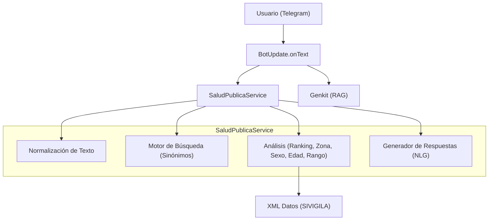

# FUNCIONALIDAD TÉCNICA - Módulo Salud Pública

## Descripción
El servicio `SaludPublicaService` es un motor de análisis epidemiológico basado en datos estructurados (XML). Permite consultas analíticas, comparativas y estadísticas sin depender de modelos generativos (Genkit) para datos precisos, garantizando veracidad y evitando alucinaciones.

## Arquitectura del Servicio



## Geolocalización (Búsqueda por proximidad)

Se implementó un flujo de proximidad que detecta consultas tipo "cerca de mí" y solicita la ubicación al usuario mediante un teclado con `request_location: true`. El estado de conversación utiliza la clave `provider_search_location` en `userState` para continuar el flujo cuando se recibe la ubicación.

- Funciones clave:
    - `isNearbyLocationQuery(text: string): boolean` — detecta frases de proximidad.
    - `requestLocationForNearbyProviders(ctx, userId?)` — envía un teclado de Telegram que solicita ubicación.
    - `@On('location') onLocation(ctx)` — maneja la ubicación recibida y llama a `YopalHealthService.findNearby(lat, lon, radiusKm)`.

```mermaid
graph TD
    User((Usuario Telegram)) --> Bot[BotUpdate.onText]
    Bot -->|Detecta 'cerca de mí'| Request[Request location (keyboard)]
    Request --> User
    User -->|Envía ubicación| Bot_OnLocation[Bot @On('location')]
    Bot_OnLocation --> Yopal[YopalHealthService.findNearby]
    Yopal --> Bot_OnLocation
    Bot_OnLocation --> Reply[Bot reply con prestadores]
```

## Métodos Clave

1. **`procesarPregunta(texto)`**: Router de intenciones que clasifica la consulta y delega al análisis correspondiente o al fallback/ambigüedad.
2. **`buscarEventosAmbigua(nombre)`**: Motor de búsqueda con soporte de sinónimos y resolución de coincidencias múltiples.
3. **`topEventos(n)` / `bottomEventos(n)`**: Rankings de incidencia epidemiológica.
4. **`eventosPorRango(min, max)`**: Filtro estadístico avanzado.
5. **`procesarPreguntaCompleja(texto)`**: Motor de análisis para comparativas directas (ej: Dengue vs Chikungunya).
6. **`_formatearRespuesta(datos, tipo)`**: Motor de generación de lenguaje natural (NLG) que asegura salidas coherentes y con contexto (porcentajes, emojis, conclusiones).
