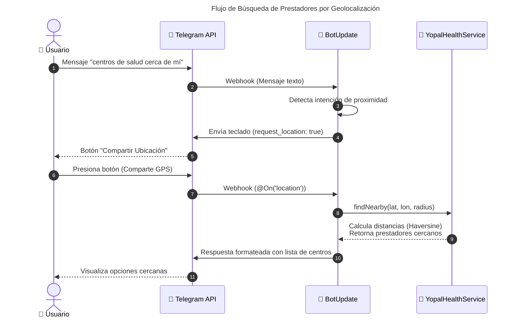

# FUNCIONALIDAD TÉCNICA - Módulo Salud Pública

## Descripción
El servicio `SaludPublicaService` es un motor de análisis epidemiológico basado en datos estructurados (XML). Permite consultas analíticas, comparativas y estadísticas sin depender de modelos generativos (Genkit) para datos precisos, garantizando veracidad y evitando alucinaciones.

## Arquitectura del Servicio

```mermaid
---
title: Arquitectura de SaludPublicaService
---
graph TD
    classDef user fill:#e1f5fe,stroke:#01579b,stroke-width:2px,color:#01579b
    classDef router fill:#fce4ec,stroke:#c2185b,stroke-width:2px,color:#c2185b,font-weight:bold
    classDef core fill:#e8f5e9,stroke:#2e7d32,stroke-width:2px,color:#2e7d32
    classDef rag fill:#fff3e0,stroke:#e65100,stroke-width:2px,color:#e65100
    classDef data fill:#f3e5f5,stroke:#7b1fa2,stroke-width:2px,color:#4a148c

    User((👤 Usuario Telegram)):::user --> Router{🤖 BotUpdate.onText}:::router
    Router -->|Ruta Directa| Publica[🏥 SaludPublicaService]:::core
    Router -->|Ruta IA| RAG[🧠 Genkit RAG]:::rag
    
    subgraph Motor ["⚙️ Motor de Análisis (SaludPublicaService)"]
        direction TB
        Normalizer[🔤 Normalización de Texto]:::core
        SearchEngine[🔍 Motor de Búsqueda<br/>Sinónimos]:::core
        Analytics[📈 Análisis Estadístico<br/>Ranking, Zona, Sexo, Edad]:::core
        NLG[💬 Generador de Respuestas<br/>NLG Estructurado]:::core
        
        Normalizer --> SearchEngine --> Analytics --> NLG
    end
    
    Publica --> Normalizer
    
    Analytics -->|Consulta O(1)| Data[(📂 XML SIVIGILA)]:::data
```

## Geolocalización (Búsqueda por proximidad)

Se implementó un flujo de proximidad que detecta consultas tipo "cerca de mí" y solicita la ubicación al usuario mediante un teclado con `request_location: true`. El estado de conversación utiliza la clave `provider_search_location` en `userState` para continuar el flujo cuando se recibe la ubicación.

- Funciones clave:
    - `isNearbyLocationQuery(text: string): boolean` — detecta frases de proximidad.
    - `requestLocationForNearbyProviders(ctx, userId?)` — envía un teclado de Telegram que solicita ubicación.
    - `@On('location') onLocation(ctx)` — maneja la ubicación recibida y llama a `YopalHealthService.findNearby(lat, lon, radiusKm)`.



## Métodos Clave

1. **`procesarPregunta(texto)`**: Router de intenciones que clasifica la consulta y delega al análisis correspondiente o al fallback/ambigüedad.
2. **`buscarEventosAmbigua(nombre)`**: Motor de búsqueda con soporte de sinónimos y resolución de coincidencias múltiples.
3. **`topEventos(n)` / `bottomEventos(n)`**: Rankings de incidencia epidemiológica.
4. **`eventosPorRango(min, max)`**: Filtro estadístico avanzado.
5. **`procesarPreguntaCompleja(texto)`**: Motor de análisis para comparativas directas (ej: Dengue vs Chikungunya).
6. **`_formatearRespuesta(datos, tipo)`**: Motor de generación de lenguaje natural (NLG) que asegura salidas coherentes y con contexto (porcentajes, emojis, conclusiones).
