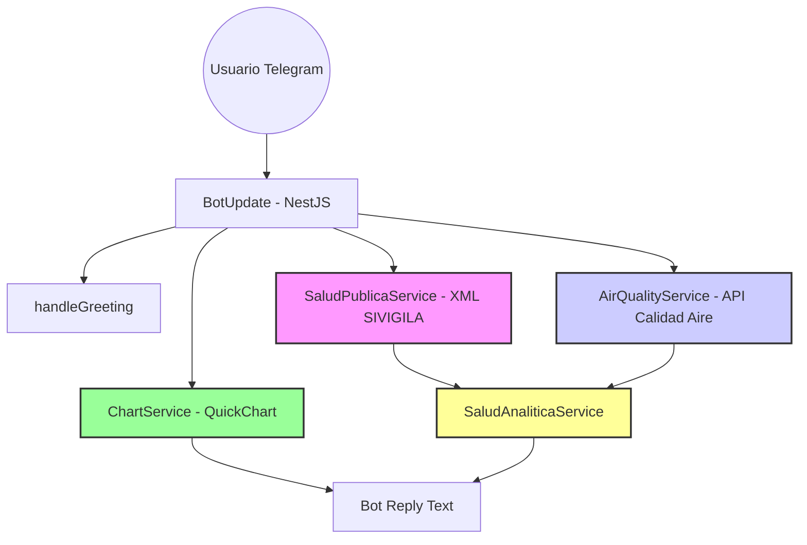

# 🏥 Salud IA Bot - Colombia

> **Asistente inteligente de salud pública impulsado por IA Generativa para la prevención y monitoreo de enfermedades en Colombia.**


---

## 🌟 Descripción

**Salud IA Bot** es una solución innovadora diseñada para democratizar el acceso a la información de salud pública en Colombia. Utilizando la potencia de **Genkit** y el modelo **Gemini 2.5 Flash**, el bot actúa como un experto en salud pública, proporcionando respuestas precisas sobre prevención de enfermedades, reportes de brotes y orientación sanitaria.

El objetivo principal es servir como un puente eficiente entre los datos complejos de salud pública y el ciudadano común a través de una interfaz familiar: **Telegram**, aportando valor preventivo mediante el cruce de datos oficiales de salud, vacunación y medio ambiente.

---

## 🚀 Características Principales

- **🧠 IA Especializada + RAG**: Genkit con Google Gemini 2.5 Flash genera respuestas basadas en contexto real de salud pública y evitando información no sustentada.
- **🛡️ Módulo de Salud Sexual**: Guía especializada para acceso a información sobre derechos, prevención (ITS, VIH), rutas de atención ante violencias y guías médicas predefinidas (ej. Cáncer de Próstata).
- **🔎 Motor de Búsqueda Robusto**: Implementación de búsqueda flexible mediante normalización de texto, optimizado para lenguaje natural y consultas con errores ortográficos o gramaticales.
- **📊 Datos reales integrados**: Soporta análisis de eventos de salud pública, salud mental CIE-10, salud sexual y servicios de salud locales.
- **📈 Visualización Gráfica Dinámica**: Generación instantánea de gráficos (barras, tortas, donas) mediante la integración con **QuickChart**, permitiendo visualizar tendencias de salud mental, calidad del aire y distribución de servicios sin salir de Telegram.
- **🏥 Búsqueda local de centros y prestadores**: Consultas en Antioquia, Boyacá, Yopal y Cali.
- **📈 Análisis Epidemiológico Avanzado**:
  - Rankings de incidencia.
  - Comparativas directas y demográficas.
  - Filtrado de eventos.
- **🤖 Predicción y Valor Preventivo**: Sistema avanzado que cruza indicadores de salud pública (SIVIGILA), **cobertura de vacunación** y **datos ambientales en tiempo real (calidad del aire)** para proyectar niveles de riesgo y brindar recomendaciones preventivas proactivas.
- **✉️ Experiencia Telegram mejorada**: Mensajería fragmentada, saludos personalizados, soporte de `/start` y `/help`, y gestión profesional de consultas fuera de alcance.

### 🏗️ Arquitectura del Sistema



---

## 💡 Preguntas Frecuentes y Ejemplos de uso

Aquí tienes ejemplos de cómo interactuar con el bot:

### 🔬 Análisis Epidemiológico y Predicción

1. "Predecir riesgo de tuberculosis en Antioquia"
2. "¿Cómo es la calidad del aire en Antioquia?"
3. "¿Cuáles son los eventos de salud pública más frecuentes en Colombia?"
4. "¿Cuáles son los derechos en salud sexual para jóvenes?"
5. "¿Cuántos casos de Dengue se han reportado en Cali?"
6. "Compara los casos de malaria entre hombres y mujeres en Yopal."

### 📊 Predicción de Casos

7. "¿Cómo se distribuyen los casos de tuberculosis por ciclo de vida en Bogotá?"
8. "Predecir casos de dengue en Bogotá"
9. "Analizar riesgo de dengue en Cali"

### 🍃 Factores Ambientales

10. "¿Cuál es la calidad del aire en Medellín?"
11. "¿Qué indicadores ambientales hay actualmente en Valle del Cauca?"
12. "¿Cómo es la calidad del aire en Santa Fé de Antioquia?"

### 🧠 Salud Mental, Sexual y Emergencias

13. "¿Cuáles son los perfiles de riesgo en salud mental?"
14. "¿Qué hacer en caso de una urgencia por mordedura de serpiente?"
15. "¿Cómo acceder a una ruta de atención en violencia de género en Cali?"
16. "¿Qué servicios de salud hay en Yopal?"

### 📊 Visualización Gráfica (¡NUEVO!)

**Calidad del Aire**

- "Graficar aire en Cali", "Muéstrame la calidad del aire en Bogotá", "Visualizar contaminación en Medellín"
- "Ver indicadores ambientales de Yopal"
- "Graficar datos ambientales" (El bot preguntará la ciudad si no se especifica)
  **Salud Mental**
- "Graficar diagnósticos de salud mental", "Muéstrame un gráfico de depresión y ansiedad en Colombia"
- "Visualizar estadísticas de psicología", "Ver gráfico de salud mental"
  **Servicios de Salud en Cali**
- "Muéstrame un gráfico de los servicios en Cali", "Graficar servicios de salud en Cali", "Visualizar categorías de salud en Cali"
  **Salud Pública (SIVIGILA)**
- "Graficar eventos de salud pública", "Muéstrame las enfermedades más frecuentes en el país"
- "Ver gráfico de eventos SIVIGILA", "Visualizar reporte de salud pública"
- "Ver tendencia de tuberculosis" (Gráfico de líneas)
- "Graficar sexo en casos de Dengue" (Gráfico de torta/género)
- "Ver zona de malaria" (Distribución urbana/rural)
  **Vacunación**
- "Graficar vacunas en Antioquia" (Coberturas departamentales)

---

## 🛠️ Metodología y Documentación Técnica

Este proyecto sigue un proceso de ingeniería de IA riguroso, utilizando arquitectura basada en servicios y priorizando la integridad de los datos sobre la verbosidad de la IA mediante un sistema de _bypass_ de respuesta.

👉 **[Consulta la Memoria Técnica Completa aquí](./DOCUMENTACION_TECNICA.md)**

---

## 🛠️ Stack Tecnológico

| Componente           | Tecnología                                                                | Propósito                                        |
| :------------------- | :------------------------------------------------------------------------ | :----------------------------------------------- |
| **Framework**        | [NestJS](https://nestjs.com/)                                             | Arquitectura backend modular y escalable.        |
| **IA Orchestration** | [Genkit](https://firebase.google.com/docs/genkit)                         | Gestión de flujos de IA y despliegue.            |
| **LLM**              | [Gemini 2.5 Flash](https://deepmind.google/technologies/gemini/)          | Generación de respuestas inteligentes y rápidas. |
| **Bot Framework**    | [Telegraf](https://telegraf.js.org/)                                      | Comunicación con la API de Telegram.             |
| **Data Processing**  | [Fast-XML-Parser](https://github.com/NaturalIntelligence/fast-xml-parser) | Procesamiento eficiente de fuentes XML locales.  |

---

## ⚙️ Instalación y Configuración

### Pasos para ejecutar localmente

1. **Clonar el repositorio:**

   ```bash
   git clone https://github.com/tu-usuario/salud-ia-bot.git
   cd salud-ia-bot
   ```

2. **Instalar dependencias:**

   ```bash
   npm install
   ```

3. **Configurar variables de entorno:**
   Crea un archivo `.env` basado en `.env.example`:

   ```env
   TELEGRAM_BOT_TOKEN=tu_token_de_telegram
   GOOGLE_GENAI_API_KEY=tu_api_key_de_google
   PORT=3000
   ```

4. **Iniciar el servidor:**
   ```bash
   npm run start:dev
   ```

---

## 📝 Licencia

Este proyecto ha sido desarrollado para el **Concurso IA Colombia**.
© 2026 - Todos los derechos reservados.
