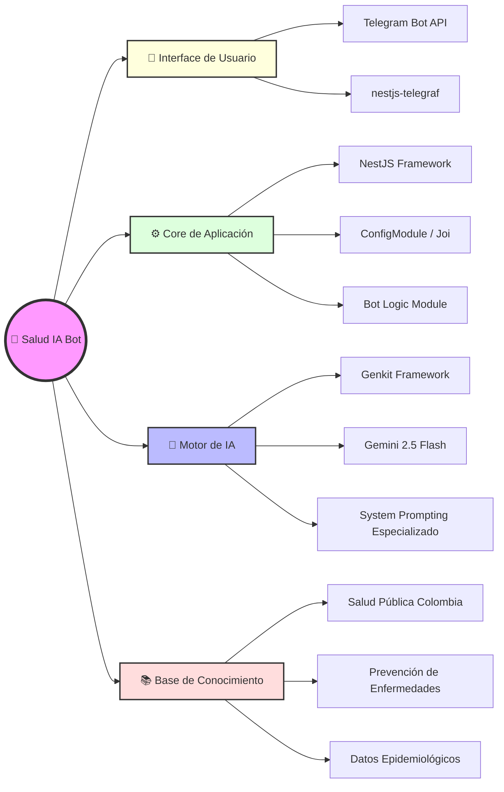

# 🏥 Salud IA Bot - Colombia
> **Asistente inteligente de salud pública impulsado por IA Generativa para la prevención y monitoreo de enfermedades en Colombia.**


---

## 🌟 Descripción
**Salud IA Bot** es una solución innovadora diseñada para democratizar el acceso a la información de salud pública en Colombia. Utilizando la potencia de **Genkit** y el modelo **Gemini 2.5 Flash**, el bot actúa como un experto en salud pública, proporcionando respuestas precisas sobre prevención de enfermedades, reportes de brotes y orientación sanitaria.

El objetivo principal es servir como un puente eficiente entre los datos complejos de salud pública y el ciudadano común a través de una interfaz familiar: **Telegram**.

---

## 🧠 Mapa Mental del Proyecto



---

## 🚀 Características Principales

- **🧠 IA Especializada**: Configurado con un rol de experto en salud pública colombiana para garantizar respuestas contextualizadas.
- **⚡ Respuesta Ultra-Rápida**: Implementado con `gemini-2.5-flash` para una latencia mínima.
- **🛠️ Arquitectura Robusta**: Construido sobre NestJS, asegurando escalabilidad y mantenibilidad.
- **🔒 Seguridad de Datos**: Manejo estricto de variables de entorno y validación de esquemas con Joi.
- **💬 Interacción Natural**: Interfaz conversacional fluida a través de Telegram.

---

## 🛠️ Stack Tecnológico

| Componente | Tecnología | Propósito |
| :--- | :--- | :--- |
| **Framework** | [NestJS](https://nestjs.com/) | Arquitectura backend modular y escalable. |
| **IA Orchestration** | [Genkit](https://firebase.google.com/docs/genkit) | Gestión de flujos de IA y despliegue. |
| **LLM** | [Gemini 2.5 Flash](https://deepmind.google/technologies/gemini/) | Generación de respuestas inteligentes y rápidas. |
| **Bot Framework** | [Telegraf](https://telegraf.js.org/) | Comunicación con la API de Telegram. |
| **Validación** | [Joi](https://joi.dev/) | Validación de variables de entorno. |

---

## ⚙️ Instalación y Configuración

### Requisitos Previos
- Node.js (v18+)
- npm o yarn
- Un Bot Token de Telegram (obtenido vía `@BotFather`)
- Una API Key de Google AI Studio

### Pasos para ejecutar localmente

1. **Clonar el repositorio:**
   ```bash
   git clone https://github.com/tu-usuario/salud-ia-bot.git
   cd salud-ia-bot
   ```

2. **Instalar dependencias:**
   ```bash
   npm install
   ```

3. **Configurar variables de entorno:**
   Crea un archivo `.env` en la raíz del proyecto basado en `.env.example`:
   ```env
   TELEGRAM_BOT_TOKEN=tu_token_de_telegram
   GOOGLE_GENAI_API_KEY=tu_api_key_de_google
   PORT=3000
   ```

4. **Iniciar el servidor:**
   ```bash
   npm run start:dev
   ```

---

## 📝 Licencia
Este proyecto ha sido desarrollado para el **Concurso IA Colombia**.
© 2026 - Todos los derechos reservados.
