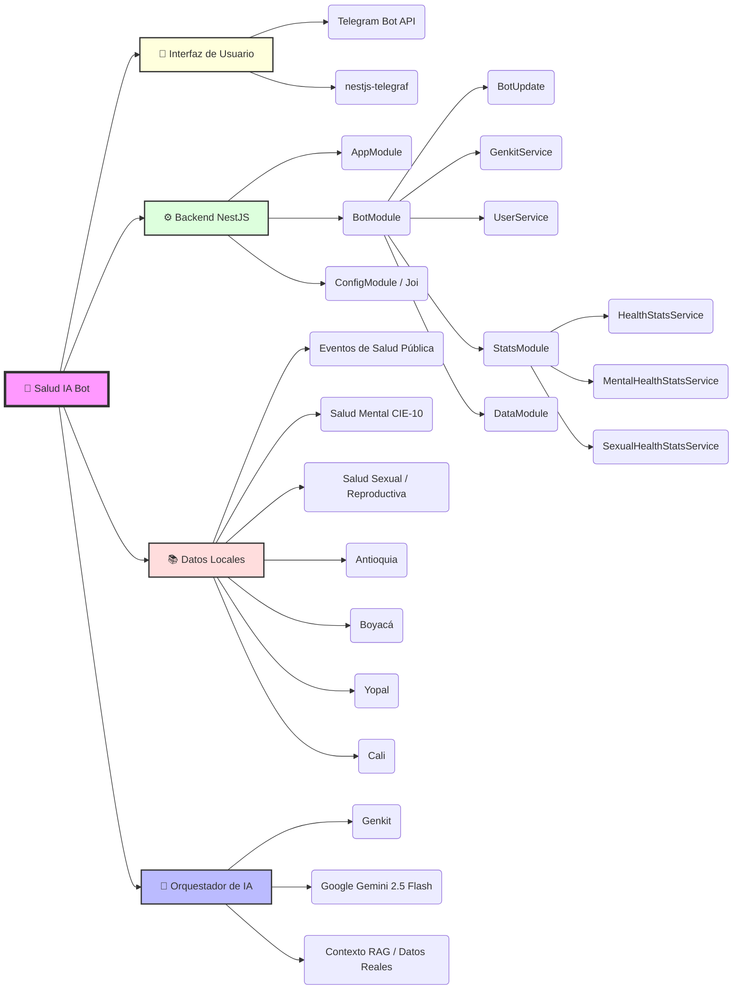

# 🏥 Salud IA Bot - Colombia

> **Asistente inteligente de salud pública impulsado por IA Generativa para la prevención y monitoreo de enfermedades en Colombia.**


---

## 🌟 Descripción

**Salud IA Bot** es una solución innovadora diseñada para democratizar el acceso a la información de salud pública en Colombia. Utilizando la potencia de **Genkit** y el modelo **Gemini 2.5 Flash**, el bot actúa como un experto en salud pública, proporcionando respuestas precisas sobre prevención de enfermedades, reportes de brotes y orientación sanitaria.

El objetivo principal es servir como un puente eficiente entre los datos complejos de salud pública y el ciudadano común a través de una interfaz familiar: **Telegram**.

---

## 🧠 Mapa Mental del Proyecto



---

## 🚀 Características Principales

- **🧠 IA Especializada + RAG**: Genkit con Google Gemini 2.5 Flash genera respuestas basadas en contexto real de salud pública y evitando información no sustentada.
- **📊 Datos reales cargados en XML**: Soporta análisis de eventos de salud pública, salud mental CIE-10, salud sexual y servicios de salud locales.
- **🏥 Búsqueda local de centros y prestadores**: Consultas en Antioquia (incluyendo Valle de Aburrá), Boyacá, Yopal y Cali por municipio, sede, código, prestador o teléfono.
- **📈 Análisis inteligente**: Rankings de incidencia, brechas de género, comparaciones urbano/rural, distribución etaria y ciclo de vida en salud mental.
- **✉️ Experiencia Telegram mejorada**: Mensajería fragmentada para textos largos, saludos personalizados y soporte de `/start` y `/help`.
- **🛠️ Plataforma modular**: NestJS + módulos de datos, estadísticas y bot que facilitan ampliaciones futuras.
- **🔒 Validación de configuración**: Configuración de entorno robusta con `ConfigModule` y `Joi`.

---

## 🛠️ Metodología y Documentación Técnica

Este proyecto no solo es una implementación técnica, sino que sigue un proceso de ingeniería de IA riguroso:

- **Metodología CRISP-ML**: El desarrollo se rige bajo el estándar _Cross-Industry Standard Process for Machine Learning_, cubriendo desde el entendimiento del negocio hasta el despliegue.
- **Orquestación con Genkit**: Implementación de flujos de IA avanzados, permitiendo una separación clara entre la lógica de aplicación y la inteligencia artificial.
- **Documentación Exhaustiva**: Contamos con una memoria técnica detallada que incluye el análisis de datos, flujos de trabajo y justificación de arquitectura.

👉 **[Consulta la Memoria Técnica Completa aquí](./DOCUMENTACION_TECNICA.md)**

---

## 🌍 Impacto Esperado

La implementación de **Salud IA Bot** busca generar un valor tangible en tres dimensiones:

- **Social**: Democratización del acceso a la información de salud pública y fomento de la cultura de prevención en toda la población colombiana.
- **Económico**: Reducción de la saturación en los servicios de primer nivel de atención y optimización de los costos operativos del sistema de salud.
- **Ambiental**: Digitalización de la comunicación sanitaria, eliminando la dependencia de material impreso para campañas de prevención.

---

## 🛠️ Stack Tecnológico

| Componente           | Tecnología                                                       | Propósito                                        |
| :------------------- | :--------------------------------------------------------------- | :----------------------------------------------- |
| **Framework**        | [NestJS](https://nestjs.com/)                                    | Arquitectura backend modular y escalable.        |
| **IA Orchestration** | [Genkit](https://firebase.google.com/docs/genkit)                | Gestión de flujos de IA y despliegue.            |
| **LLM**              | [Gemini 2.5 Flash](https://deepmind.google/technologies/gemini/) | Generación de respuestas inteligentes y rápidas. |
| **Bot Framework**    | [Telegraf](https://telegraf.js.org/)                             | Comunicación con la API de Telegram.             |
| **Validación**       | [Joi](https://joi.dev/)                                          | Validación de variables de entorno.              |

---

## ⚙️ Instalación y Configuración

### Requisitos Previos

- Node.js (v18+)
- npm o yarn
- Un Bot Token de Telegram (obtenido vía `@BotFather`)
- Una API Key de Google AI Studio

### Pasos para ejecutar localmente

1. **Clonar el repositorio:**

   ```bash
   git clone https://github.com/tu-usuario/salud-ia-bot.git
   cd salud-ia-bot
   ```

2. **Instalar dependencias:**

   ```bash
   npm install
   ```

3. **Configurar variables de entorno:**
   Crea un archivo `.env` en la raíz del proyecto basado en `.env.example`:

   ```env
   TELEGRAM_BOT_TOKEN=tu_token_de_telegram
   GOOGLE_GENAI_API_KEY=tu_api_key_de_google
   PORT=3000
   ```

4. **Iniciar el servidor:**
   ```bash
   npm run start:dev
   ```

---

## 📝 Licencia

Este proyecto ha sido desarrollado para el **Concurso IA Colombia**.
© 2026 - Todos los derechos reservados.
