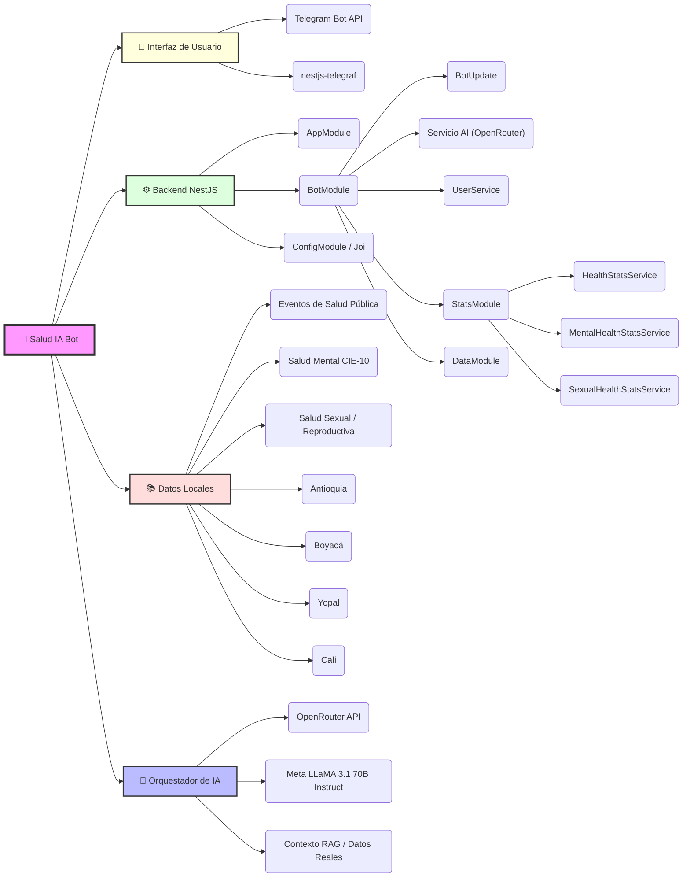
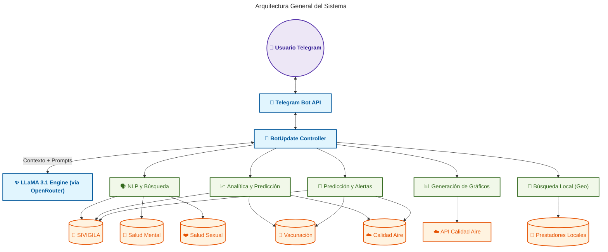

# 🏥 Salud IA Bot - Colombia

> **Asistente inteligente de salud pública impulsado por IA Generativa para la prevención y monitoreo de enfermedades en Colombia.**

<p align="center">
  
</p>


---

## 🌟 Descripción

**Salud IA Bot** es una solución innovadora diseñada para democratizar el acceso a la información de salud pública en Colombia. Utilizando la API de **OpenRouter** y el potente modelo **Meta-Llama 3.1 70B Instruct**, el bot actúa como un experto en salud pública, proporcionando respuestas precisas sobre prevención de enfermedades, reportes de brotes y orientación sanitaria.

El objetivo principal es servir como un puente eficiente entre los datos complejos de salud pública y el ciudadano común a través de una interfaz familiar: **Telegram**, aportando valor preventivo mediante el cruce de datos oficiales de salud, vacunación y medio ambiente.

---

## 🧠 Mapa Mental del Proyecto



---

## 🚀 Características Principales

- **🧠 IA Especializada + RAG**: Orquestación directa usando el SDK de OpenAI hacia OpenRouter (LLaMA 3.1) para generar respuestas basadas en contexto real de salud pública y evitando alucinaciones.
- **🔬 Módulo de Salud Pública Avanzado**: Procesamiento de lenguaje natural para consultas complejas sobre SIVIGILA (resúmenes nacionales, comparativas, brechas de género y ciclos de vida).
- **🛡️ Módulo de Salud Sexual**: Guía especializada para acceso a información sobre derechos, prevención (ITS, VIH), rutas de atención ante violencias y guías médicas predefinidas (ej. Cáncer de Próstata).
- **🔎 Motor de Búsqueda Robusto**: Implementación de búsqueda flexible mediante normalización de texto, optimizado para lenguaje natural y consultas con errores ortográficos o gramaticales.
- **📊 Datos reales integrados**: Soporta análisis de eventos de salud pública, salud mental CIE-10, salud sexual y servicios de salud locales.
- **📈 Visualización Gráfica Dinámica**: Generación instantánea de gráficos (barras, tortas, líneas) mediante la integración con **QuickChart**, permitiendo visualizar tendencias y distribuciones demográficas.
- **🏥 Búsqueda local de centros y prestadores**: Consultas avanzadas y enrutamiento en Antioquia, Boyacá, Yopal y Cali.
- **📍 Enrutamiento Regional Directo y Detección de Urgencias (Cali) (¡NUEVO!)**: Procesamiento de lenguaje natural ultra rápido para Cali que detecta automáticamente intenciones de urgencias, niveles de complejidad, sedes específicas o servicios puntuales (odontología, ginecología, farmacia, etc.), entregando respuestas formateadas directo de la base de datos XML sin pasar por la IA para garantizar un 0% de alucinación.
- **📍 Búsqueda por ubicación (“cerca de mí”)**: El bot detecta consultas de proximidad y solicita compartir la ubicación con un teclado de Telegram; actualmente la búsqueda por coordenadas está disponible para Yopal (radio por defecto 5 km). Enviar ubicación: usar el botón "Enviar ubicación" desde el selector de Telegram.
- **📈 Análisis Epidemiológico Avanzado**:
  - Rankings de incidencia.
  - Comparativas directas y demográficas.
  - Filtrado de eventos.
- **🔮 Predicción y alertas tempranas**: Servicio modular que procesa consultas de `predicción`, `pronóstico`, `alerta temprana` y `clasificación de riesgo`.
  - Soporta análisis dinámico de `dengue`, `zika`, `malaria`, `tuberculosis` y otros eventos de salud pública.
  - Genera listados de eventos y ubicaciones disponibles en tiempo real.
- **🤖 Sistema de Scoring Compuesto (NUEVO)**: Algoritmo multidimensional que cruza datos de SIVIGILA, cobertura de vacunación y factores ambientales para calcular el riesgo epidemiológico. Combina cuatro dimensiones ponderadas:
  - Volumen de casos (40%)
  - Ruralidad (20%)
  - Brecha de vacunación (25%)
  - Población vulnerable (15%)

  Proporciona nivel de riesgo (BAJO, MEDIO, ALTO, CRÍTICO), desglose detallado de puntajes y recomendaciones específicas.

- **✉️ Experiencia Telegram mejorada**: Mensajería fragmentada, saludos personalizados, soporte de `/start` y `/help`, y gestión profesional de consultas fuera de alcance.

### 🏗️ Arquitectura del Sistema



---

## 💡 Preguntas Frecuentes y Ejemplos de uso

Aquí tienes ejemplos de cómo interactuar con el bot:

### 🧠 Análisis de Riesgo con Scoring Compuesto

1. "Analizar riesgo de dengue en Cali"
2. "Clasificar riesgo de tuberculosis en Antioquia"
3. "Predecir riesgo de malaria en Boyacá"
4. "Riesgo de zika en el Valle del Cauca"

### 📈 Predicciones y Alertas

5. "Alertas tempranas de salud pública"
6. "Pronóstico de dengue en Antioquia"
7. "Predecir casos de tuberculosis en Bogotá"
8. "Tendencia de zika en los próximos meses en Cali"

### 🔬 Análisis Epidemiológico

9. "¿Cómo es la calidad del aire en Antioquia?"
10. "¿Cuáles son los eventos de salud pública más frecuentes en Colombia?"
11. "Compara los casos de malaria entre hombres y mujeres en Yopal."
12. "¿Cuántos casos de Dengue se han reportado en Cali?"
13. "¿Qué enfermedad afecta más a los adolescentes?"

### 🍃 Factores Ambientales

14. "¿Cuál es la calidad del aire en Medellín?"
15. "¿Qué indicadores ambientales hay actualmente en Valle del Cauca?"
16. "¿Cómo es la calidad del aire en Santa Fé de Antioquia?"

### 🧠 Salud Mental, Sexual y Emergencias

17. "¿Cuáles son los perfiles de riesgo en salud mental?"
18. "¿Qué hacer en caso de una urgencia por mordedura de serpiente?"
19. "¿Cómo acceder a una ruta de atención en violencia de género en Cali?"

### 📍 Servicios de Salud Locales y Urgencias (Cali, Yopal, Antioquia, Boyacá)

20. "¿Dónde atienden urgencias en Cali?" (Detección de prioridad de urgencia)
21. "Sedes de alta complejidad en Cali" (Filtro por nivel de complejidad)
22. "Buscar servicio de odontología en Cali" (Filtro por servicio específico)
23. "Sede Alfonso López Cali" (Filtro por sede exacta con su portafolio de servicios)
24. "¿Qué servicios de salud hay en Yopal?" (Búsqueda local georreferenciada)

### 📊 Visualización Gráfica

**Calidad del Aire**

- "¿Puedes graficar la calidad del aire en Andes?" (o cualquier otro municipio de Colombia)
- "Graficar aire en Cali", "Muéstrame la calidad del aire en Bogotá"

**Salud Mental**

- "Graficar diagnósticos de salud mental", "Muéstrame un gráfico de depresión y ansiedad en Colombia"

**Servicios de Salud en Cali**

- "Muéstrame un gráfico de los servicios en Cali", "Graficar servicios de salud en Cali"

**Salud Pública (SIVIGILA)**

- "Graficar eventos de salud pública", "Muéstrame las enfermedades más frecuentes en el país"
- "Ver tendencia de tuberculosis" (Gráfico de líneas)
- "Graficar sexo en casos de dengue" (Gráfico de torta/género)

**Consultas de Inteligencia Epidemiológica (NLP)**

- "Dame un resumen de salud pública"
- "¿Qué enfermedad es más rural o urbana?"
- "Comparar dengue vs zika"
- "¿Qué enfermedad afecta más a los adolescentes?"
- "Proporción global por sexo"
- "Eventos con mayor brecha de género"

**Vacunación**

- "Graficar vacunas en Antioquia" (Coberturas departamentales)

---

## 🛠️ Metodología y Documentación Técnica

Este proyecto sigue un proceso de ingeniería de IA riguroso, utilizando arquitectura basada en servicios y priorizando la integridad de los datos sobre la verbosidad de la IA mediante un sistema de _bypass_ de respuesta.

👉 **[Consulta la Memoria Técnica Completa aquí](./DOCUMENTACION_TECNICA.md)**

---

## 🛠️ Stack Tecnológico

| Componente           | Tecnología                                                                | Propósito                                                                     |
| :------------------- | :------------------------------------------------------------------------ | :---------------------------------------------------------------------------- |
| **Framework**        | [NestJS](https://nestjs.com/)                                             | Arquitectura backend modular y escalable.                                     |
| **IA Orchestration** | [OpenAI SDK / OpenRouter](https://openrouter.ai)                          | Integración directa evitando _lock-in_ y permitiendo flexibilidad de modelos. |
| **LLM**              | [Meta LLaMA 3.1 70B Instruct](https://ai.meta.com/llama/)                 | Generación de respuestas especializadas, fluidas y coherentes.                |
| **Bot Framework**    | [Telegraf](https://telegraf.js.org/)                                      | Comunicación con la API de Telegram.                                          |
| **Data Processing**  | [Fast-XML-Parser](https://github.com/NaturalIntelligence/fast-xml-parser) | Procesamiento eficiente de fuentes XML locales.                               |

---

## ⚙️ Instalación y Configuración

### Pasos para ejecutar localmente

1. **Clonar el repositorio:**

   ```bash
   git clone https://github.com/RubenDarioGuerreroNeira/Ecosistema-IA-Colombia.git salud-ia-bot
   cd salud-ia-bot
   ```

2. **Instalar dependencias:**

   ```bash
   npm install
   ```

3. **Configurar variables de entorno:**
   Crea un archivo `.env` basado en `.env.example`:

   ```env
   TELEGRAM_BOT_TOKEN=tu_token_de_telegram
   OPENROUTER_API_KEY=tu_api_key_de_openrouter
   OPENROUTER_MODEL=meta-llama/Meta-Llama-3.1-70B-Instruct
   PORT=3000
   ```

4. **Iniciar el servidor:**
   ```bash
   npm run start:dev
   ```

---

## 📝 Licencia

Este proyecto ha sido desarrollado para el **Concurso IA Colombia**.
© 2026 - Todos los derechos reservados.
